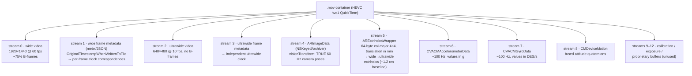
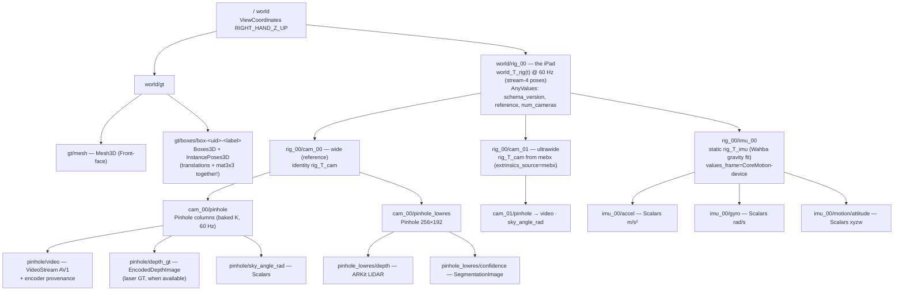
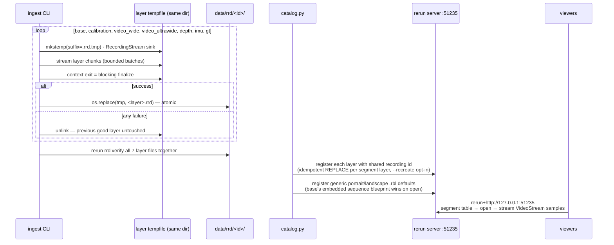

# ARKitScenes → Rerun: Pipeline Architecture

End-to-end architecture of this repo's pipeline: **download** raw ARKitScenes sequences from Apple's CDN, **ingest** each sequence into a Rerun `.rrd` recording, and **register** the recordings into a local Rerun catalog for browsing, querying, and streaming playback.

All diagrams are Mermaid; they render on GitHub and in Obsidian.

---

## 1. Bird's-eye view

```mermaid
flowchart LR
    subgraph DL["1 · DOWNLOAD  (arkitscenes-download-sample task or downloader module)"]
        CDN["Apple CDN<br>docs-assets.developer.apple.com<br>/ml-research/datasets/arkitscenes/v1"]
        META["raw/metadata.csv<br>5,071 sequences<br>visit_id · fold · sky_direction*"]
        ASSETS["per-sequence raw assets<br>mov · traj · depth PNGs · intrinsics<br>annotation json · mesh ply"]
        LASER["optional per-visit laser scans<br>(sample/pipeline disable them;<br>never ingested: no published FARO→ARKit alignment)"]
        CDN --> META
        CDN -->|"curl -C - --retry, .part → rename<br>zips: extract to staging dir → atomic rename"| ASSETS
        CDN --> LASER
    end

    subgraph ING["2 · INGEST  (python -m arkitscenes_download.ingest --video-id N)"]
        MOV["MOV demux<br>13 streams"]
        PIPE["per-sequence DAG<br>(see §3)"]
        RRD["data/rrd/&lt;id&gt;/&lt;layer&gt;.rrd<br>7 layers · each tempfile → os.replace<br>all verified together"]
        MOV --> PIPE --> RRD
    end

    subgraph SRV["3 · REGISTER + SERVE"]
        SERVER["rerun server :51235<br>in-memory OSS catalog<br>(arkitscenes-download-serve task)"]
        REG["catalog.py  (arkitscenes-download-register task)<br>7 layers stacked per segment<br>generic blueprints = dataset defaults"]
        VIEW["viewers<br>headed desktop · headless+MCP<br>dataframe / SQL queries"]
        RRD2["arkitscenes dataset<br>1 layered segment per video_id<br>embedded sequence blueprint wins on open<br>properties = queryable columns"]
        REG --> SERVER --> RRD2 --> VIEW
    end

    ASSETS --> MOV
    META -->|sky_direction label only<br>(orientation is MEASURED)| PIPE
    RRD --> REG
```

`*` `sky_direction` in Apple's metadata is **wrong for ~60% of sampled sequences** — the pipeline measures orientation from gravity instead and keeps the label only as a property (`sky_direction_label`).

---

## 2. The MOV is the master

Each sequence's `.mov` carries far more than video. Everything time-critical in the pipeline is recovered from its 13 streams:



Key consequences:

- The published PNG folders (`lowres_wide`, `vga_wide`, `ultrawide`, `wide`) are **derivatives** of the mov and are never ingested.
- IMU exists **only** here (no standalone asset). One demux pass decodes streams 6/7/8 together.
- The **two cameras have different PTS origins** (7.7–98.8 ms apart in the sample set), so each camera's clock offset is recovered independently.

---

## 3. Ingestion DAG (full detail)

```mermaid
flowchart TB
    subgraph INPUTS["Inputs (data/raw/<split>/<id>/)"]
        IMOV[".mov"]
        ITRAJ["lowres_wide.traj<br>10 Hz, rows = world→camera<br>(axis-angle Rodrigues + t)"]
        IDEPTH["lowres_depth/*.png<br>256×192 u16 mm @ 60 fps"]
        IHDEPTH["highres_depth/*.png<br>1920×1440, ~10 fps filtered<br>(absent for non-upsampling seqs)"]
        ICONF["confidence/*.png<br>u8 ∈ {0,1,2}"]
        IPINCAM["lowres_wide_intrinsics/*.pincam<br>w h fx fy cx cy @ 60 fps"]
        IUPIN["ultrawide_intrinsics/*.pincam"]
        IANN["<id>_3dod_annotation.json<br>obbAligned boxes"]
        IMESH["<id>_3dod_mesh.ply"]
    end

    subgraph CLOCK["clock.py — per-camera clock recovery"]
        C1["stream 1 & 3 correspondences:<br>arkit_ts − pts per frame"]
        C2["offset = median<br>GATES: p99−p1 dispersion ≲ 2 ms<br>drift slope ≈ 0"]
        C3["ultrawide offset recovered<br>independently, delta recorded"]
        C4["secondary sanity: depth filename<br>timestamps land on frame grid"]
        C1 --> C2 --> C3 --> C4
    end

    subgraph MDEC["metadata.py — NSKeyedArchiver decode"]
        M1["stream 5 → CameraExtrinsics<br>rig_T_cam01 (real, validated)"]
        M2["stream 4 → visionTransform<br>60 Hz camera poses; validated vs<br>10 Hz traj (~0.8° median agreement)"]
    end

    subgraph IMU["imu.py — single demux pass (streams 6,7,8)"]
        U1["accel: g → m/s²"]
        U2["gyro: deg/s → rad/s<br>(verified vs attitude derivative, ratio 57.48)"]
        U3["attitude quaternions"]
        U4["rig.py: fit_original_camera_from_device<br>Wahba fit on gravity pairs → static rig_T_imu<br>(values stay in device frame, documented)"]
    end

    subgraph ORIENT["rig.py — measured-gravity orientation"]
        O1["sky_angles(unbaked poses)"]
        O2["circular mean → k ∈ {0,1,2,3}<br>+ ambiguity guard (spread, 45° boundary)"]
        O3["bake k·90°:<br>pixels (transcode filter) · intrinsics<br>((W−1)−cx remap, fx/fy swap for odd k)<br>· poses (∘ Rz(−k·90°)) · resolution swap"]
        O1 --> O2 --> O3
    end

    subgraph VID["mov.py — video preparation (per track)"]
        V3["transcode EVERY track: ffmpeg av1_nvenc<br>-preset p7 -rc vbr -cq 30 + rotation filter<br>(SVT-AV1 fallback; FFMPEG_PATH→PATH,<br>pixi-managed conda-forge ffmpeg w/ nvenc)<br>AV1 has NO pts/dts split → no B-frame problem"]
        V4["source PTS restored · frame count<br>+ pts==dts asserted · atomic cache write<br>fingerprint: size+mtime+stream+k+settings<br>deleted after use unless --keep-transcode-cache"]
        V5["demux prepared track →<br>raw AV1 packets (no bitstream filter)<br>500-sample batches (bounded memory)"]
        V6["VideoStream AV1 columns<br>sample + is_keyframe<br>ts = pts + per-camera offset<br>+ encoder provenance properties"]
        V3 --> V4 --> V5 --> V6
    end

    subgraph POSE["pose assembly"]
        P1["pose source = stream-4 60 Hz<br>(pose_source property)"]
        P2["resample onto actual wide<br>frame timestamps; endpoint<br>clamp-hold; coverage properties"]
        P3["world_T_rig columns<br>+ per-camera sky_angle_rad streams<br>(post-bake median ≈ 0)"]
        P1 --> P2 --> P3
    end

    subgraph DGT["depth / confidence / ground truth"]
        D1["depth: PNG passthrough (k=0)<br>or rot90 re-encode; EncodedDepthImage<br>meter=1000, 1000-frame batches"]
        D2["confidence: SegmentationImage<br>+ AnnotationContext(low/med/high),<br>batched columns"]
        D3["mesh: Mesh3D, face_rendering=Front<br>(interior visible)"]
        D4["boxes: half_sizes + labels;<br>InstancePoses3D(translations=centroid,<br>mat3x3=normalizedAxes.T)<br>2D overlay = NATIVE viewer reprojection"]
    end

    PUB["atomic layer publish (cli.py)<br>for each of 7 layers: tempfile.mkstemp(dir=output)<br>→ RecordingStream ctx → blocking finalize → os.replace<br>then rerun rrd verify all layers together"]

    IMOV --> CLOCK & MDEC & IMU & VID
    ITRAJ --> ORIENT
    ITRAJ -->|validation reference| M2
    IPINCAM -->|load once, ×7.5 scale derived| ORIENT
    IUPIN --> ORIENT
    M2 --> POSE
    ORIENT --> POSE & VID & D1 & D2
    M1 --> RIGTREE
    CLOCK --> V6
    IDEPTH & IHDEPTH --> D1
    ICONF --> D2
    IMESH --> D3
    IANN --> D4
    U1 & U2 & U3 & U4 --> RIGTREE
    POSE --> RIGTREE
    V6 --> RIGTREE
    D1 & D2 & D3 & D4 --> RIGTREE
    RIGTREE["entity data split across 7 layers (base, calibration,<br>video_wide, video_ultrawide, depth, imu, gt)<br>base embeds GT-mesh-framed blueprint (§4)<br>ONE timeline: video_time = ARKit uptime seconds"]
    RIGTREE --> PUB
```



---

## 4. Recording schema (`arkitscenes:v1`, exoego-style rig grammar)



Recording properties (queryable as catalog columns): `video_id`, `visit_id`, `split`, `schema_version`, `sky_direction_label`, `orientation_source=measured_gravity`, `orientation_quarter_turns_ccw`, wide/ultrawide clock offsets + delta, clock dispersion/drift, `pose_source`, pose-coverage counts, IMU sample counts, encoder/settings/ffmpeg version, device-frame fit quaternion + residual.

**Timeline**: a single `video_time` duration timeline whose values are ARKit device-uptime seconds — scrubber positions match raw asset filenames exactly. Each camera's samples are placed with its own independently recovered clock offset.

**Blueprints**: the base layer embeds a per-sequence default blueprint. Its `EyeControls3D` orbits the GT mesh center, using `mesh_bounding_geometry` and `orbit_eye_position` to frame the mesh at `2.2 × 1.25 ×` its bounding radius. Generic portrait and landscape blueprints remain catalog dataset defaults, but the embedded blueprint takes precedence when a segment opens.

---

## 5. Publication & catalog lifecycle



---

## 6. Conventions that will bite you (hard-won)

| Convention | Truth | Where enforced |
|---|---|---|
| `lowres_wide.traj` rows | **world→camera** (Rodrigues axis-angle + t); usable pose is the inverse. Matches Apple `TrajStringToMatrix`. | `rig.load_trajectory` |
| Camera frame | OpenCV RDF; pinhole default. | throughout |
| `normalizedAxes` | **Rows** are the box axes: `world = A.T @ local + centroid` (Apple `compute_box_3d` applies `rotmat.T`). | `gt.py` |
| Box pose in Rerun | Put **translations AND mat3x3 in `InstancePoses3D` together** — `Boxes3D(centers=…)` + separate rotation composes rotate-about-origin (rerun 0.34.1 bug). | `gt.py` |
| Orientation | Measured gravity (circular mean of sky angles), **never** the metadata label (wrong for 6/10 sampled). | `rig.py` |
| Clock | Per-camera offsets from per-frame metadata correspondences; camera PTS origins differ. | `clock.py` |
| IMU units | Accel arrives in g; gyro arrives in **deg/s** (verified ratio 57.48 vs attitude derivative). | `imu.py` |
| Video | Logged as AV1 (`av1_nvenc -cq 30`, quality-matched to source-grade HEVC at SSIM 0.984): decoded natively by dav1d, no pts/dts split so bidirectional prediction is free, packets logged raw. ~23s wide-track encode on an RTX 5090. | `mov.py` |

### Known rerun 0.34.1 bugs found by this project (repros in /tmp/arkit_spike/)

1. `VideoStream` cannot decode B-frame HEVC (documented TODO #10090) — "Error constructing the frame RPS".
2. Large B-frame HEVC `AssetVideo` inside a full recording deadlocks the viewer's ffmpeg feeder (spinner forever, zero errors).
3. `Boxes3D(centers=…)` + separate `InstancePoses3D(mat3x3=…)` rotates boxes about the entity origin instead of in place (the upstream `arkit_scenes` example has this bug, plus the missing `normalizedAxes` transpose).
4. `Spatial2DView` box reprojection artifacts were entirely downstream of (3) — retracted after the composition fix.

### Accepted tradeoffs

- All RGB in the `.rrd` is a single-generation near-lossless AV1 transcode (NVENC CQ30, SSIM ≈0.984); the original `.mov` on disk stays the master. Encoder provenance is recorded; bit-exact determinism is not promised.
- Portrait/landscape mix across sequences is correct (aspect follows device grip).
- Laser point clouds are optionally downloadable but excluded from the sample task and full pipeline; they are never ingested (no published FARO→ARKit alignment).
- The batch runner executes sequence subprocesses concurrently. The full pipeline overlaps downloading, ingestion, and shipping with shared Rich progress; per-sequence memory remains bounded.
