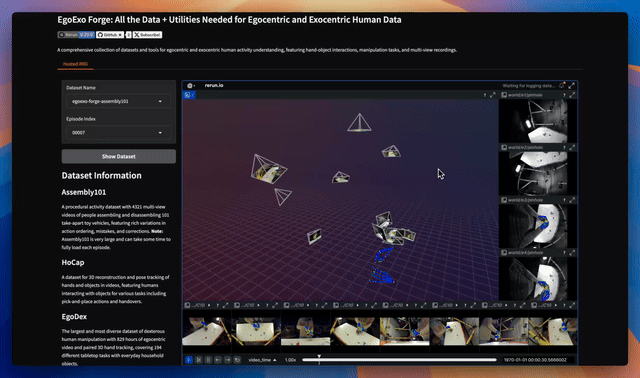

# EgoExo Forge: All the Data + Utilities Needed for Egocentric and Exocentric Human Data

Uses [Rerun](https://rerun.io/) to visualize, [Gradio](https://www.gradio.app) for an interactive UI, and [Pixi](https://pixi.sh/latest/) for a easy installation

<p align="center">
    <a title="Website" href="https://rerun.io/" target="_blank" rel="noopener noreferrer" style="display: inline-block;">
        
    </a>
    <a title="Personal Site" href="https://pablovela.dev/" target="_blank" rel="noopener noreferrer" style="display: inline-block;">
        
    </a>
    <a title="Github" href="https://github.com/rerun-io/egoexo-forge" target="_blank" rel="noopener noreferrer" style="display: inline-block;">
        
    </a>
    <a title="Social" href="https://x.com/pablovelagomez1" target="_blank" rel="noopener noreferrer" style="display: inline-block;">
        
    </a>
</p>

<p align="center">
  
</p>

## Demo
Hosted Demos can be found on huggingface spaces

<a href='https://pablovela5620-egoexo-forge-viewer.hf.space'></a>

## Installation
### Using Pixi
Make sure you have the [Pixi](https://pixi.sh/latest/#installation) package manager installed


```bash
git clone https://github.com/rerun-io/examples-monorepo.git
cd examples-monorepo/packages/egoexo-forge
pixi run -e egoexo-forge --frozen egoexo-forge-app
```

All commands can be listed using `pixi task list --manifest-path ../../pixi.toml -e egoexo-forge`

## Usage
### Gradio App
```
pixi run -e egoexo-forge --frozen egoexo-forge-app
```
### CLI

#### View ExoEgo Datasets
Use `pixi run -e egoexo-forge --frozen egoexo-forge-batch-convert -- --help` to inspect the dataset conversion CLI, or run `simplecv-view-exoego` inside the `egoexo-forge` environment to visualize various ego/exo datasets with Rerun:

```bash
# View Robocap session
pixi run -e egoexo-forge --frozen simplecv-view-exoego robocap --session-id 12

# See all options
pixi run -e egoexo-forge --frozen simplecv-view-exoego --help
```

#### Hand Tracking with WiLor (GPU Required)
Run WiLor-based hand detection and keypoint estimation on ego cameras:

```bash
# GPU environment required for hand tracking
pixi run -e egoexo-forge --frozen egoexo-forge-robocap-hand-tracking -- \
    --skip-camera-names "left,right,left_front,right_front" \
    robocap --session-id 12
```

This will:
- Detect hands in left_eye and right_eye cameras
- Extract 2D keypoints using WiLor-nano
- Triangulate 3D hand keypoints from multi-view detections
- Visualize results in Rerun

**Options:**
- `--skip-camera-names`: Comma-separated camera names to skip (e.g., skip wide-angle cameras)
- `--detection-only`: Only run hand detection (faster, no keypoints)
- `--no-triangulate`: Disable 3D triangulation
- `--frame-start/--frame-end`: Process specific frame range

You can see all tasks by running `pixi task list --manifest-path ../../pixi.toml -e egoexo-forge`

## Dataset Information

### Robocap
An egocentric dataset featuring a 6-camera helmet rig with synchronized stereo eye cameras, stereo front cameras, and wide-angle left/right cameras. Includes Kalibr-based multi-camera calibration.

### Assembly101
A procedural activity dataset with 4321 multi-view videos of people assembling and disassembling 101 take-apart toy vehicles, featuring rich variations in action ordering, mistakes, and corrections.
**Note:** Assembly101 is very large and can take some time to fully load each episode.

### HoCap
A dataset for 3D reconstruction and pose tracking of hands and objects in videos, featuring humans interacting with objects for various tasks including pick-and-place actions and handovers.

### EgoDex
The largest and most diverse dataset of dexterous human manipulation with 829 hours of egocentric video and paired 3D hand tracking, covering 194 different tabletop tasks with everyday household objects.

### UmeTrack
Coming soon...

## Supported Datasets

### Currently Supported

- [Assembly101](https://assembly-101.github.io/) ✅
- [HO-Cap](https://irvlutd.github.io/HOCap/) ✅
- [EgoDex](https://arxiv.org/abs/2505.11709) ✅
- Robocap ✅

### Planned Support

- UmeTrack 🚧

## Acknowledgements

### [Assembly101](https://assembly-101.github.io/)
```bibtex
@article{sener2022assembly101,
    title = {Assembly101: A Large-Scale Multi-View Video Dataset for Understanding Procedural Activities},
    author = {F. Sener and D. Chatterjee and D. Shelepov and K. He and D. Singhania and R. Wang and A. Yao},
    journal = {CVPR 2022},
}
```

### [HO-Cap](https://irvlutd.github.io/HOCap/)
```bibtex
@misc{wang2024hocapcapturedataset3d,
      title={HO-Cap: A Capture System and Dataset for 3D Reconstruction and Pose Tracking of Hand-Object Interaction},
      author={Jikai Wang and Qifan Zhang and Yu-Wei Chao and Bowen Wen and Xiaohu Guo and Yu Xiang},
      year={2024},
      eprint={2406.06843},
      archivePrefix={arXiv},
      primaryClass={cs.CV},
      url={https://arxiv.org/abs/2406.06843},
}
```

### [EgoDex](https://arxiv.org/abs/2505.11709)
```bibtex
@misc{hoque2025egodexlearningdexterousmanipulation,
      title={EgoDex: Learning Dexterous Manipulation from Large-Scale Egocentric Video},
      author={Ryan Hoque and Peide Huang and David J. Yoon and Mouli Sivapurapu and Jian Zhang},
      year={2025},
      eprint={2505.11709},
      archivePrefix={arXiv},
      primaryClass={cs.CV}
}
```
