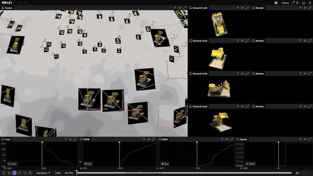
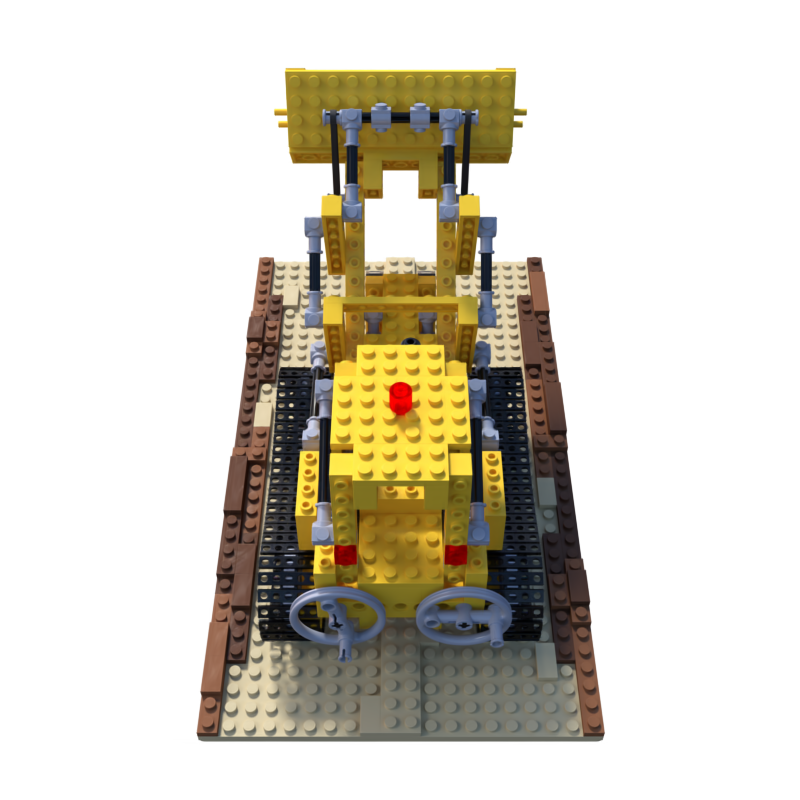
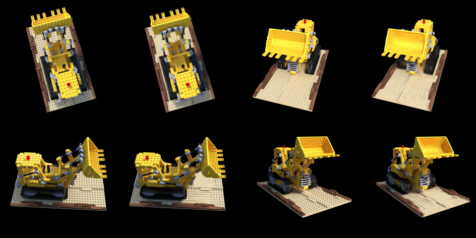

# gsplat-rust-renderer

`gsplat-rust-renderer` adds a tile-based, GPU compute Gaussian-splat visualizer to the [Rerun](https://rerun.io) desktop viewer. Python logs the upstream `Gaussians3D` component contract; Rust renders it with wgpu on Metal or Vulkan. The same GPU core also powers a standalone PNG renderer, so no CUDA is required.

<p align="center">
  
</p>

The animation sweeps the real per-iteration 7,000-step dense Brush recording inside the custom viewer: the GPU splat cloud converges from noise to the Lego bulldozer while four ground-truth/render eval pairs and the loss, PSNR, SSIM, and splat-count curves fill in.

## Requirements

- [Pixi](https://pixi.sh/latest/#installation)
- Apple Silicon with Metal, or Linux with Vulkan
- Enough local storage for build artifacts, datasets, and recordings (the supplied dense RRD is 2.4 GB)

Run every command below from the repository root. Rust and Python Rerun packages are pinned together at `0.34.1`; do not update one side independently.

## Install and build

Install the development environment and build the custom viewer:

```bash
pixi install -e gsplat-rust-renderer-dev --frozen
pixi run -e gsplat-rust-renderer-dev --frozen cargo build --release --bin gsplat-rust-renderer --manifest-path packages/gsplat-rust-renderer/Cargo.toml
```

## Download the Lego example

Download the NeRF-synthetic dataset and pretrained 3DGS-MCMC checkpoint. Both commands are idempotent.

```bash
pixi run -e gsplat-rust-renderer-dev --frozen python -m gsplat_rust_renderer.nerfbaselines data lego
pixi run -e gsplat-rust-renderer-dev --frozen python -m gsplat_rust_renderer.nerfbaselines pretrained lego
```

## Quickstart: view a pretrained splat

Start the custom viewer in one terminal:

```bash
pixi run -e gsplat-rust-renderer-dev --frozen gsplat-rust-renderer-viewer
```

Then log the pretrained PLY, all train/test cameras, and their ground-truth image planes from a second terminal:

```bash
pixi run -e gsplat-rust-renderer-dev --frozen gsplat-rust-renderer-log-scene
```

The viewer listens on `127.0.0.1:9876`. A stock Rerun viewer can ingest the data but cannot render this package's `Gaussians3D` visualizer.

<p align="center">
  
</p>

The image above is a real prediction bundled with the downloaded checkpoint.

## Brush training

### Live, headed training

On macOS, this task builds the pinned Brush `v0.3.0` metrics variant, trains for 7,000 steps, opens this custom viewer, and saves `data/brush-runs/lego-live/training.rrd` at the same time:

```bash
pixi run -e gsplat-rust-renderer-dev --frozen gsplat-rust-renderer-brush-replay-lego-live
```

The recording contains the camera ring, loss/PSNR/SSIM/splat-count curves, four eval GT/render pairs, and eight retained splat snapshots (iteration 50, every 1,000 steps, and the final step). The blueprint uses a dark gradient and continuously orbits the scene.

### Headless replay artifact

For the same bounded artifact without opening a viewer:

```bash
pixi run -e gsplat-rust-renderer-dev --frozen gsplat-rust-renderer-brush-replay-lego
```

Open the result later by passing the RRD positionally to the custom viewer:

```bash
packages/gsplat-rust-renderer/target/release/gsplat-rust-renderer packages/gsplat-rust-renderer/data/brush-runs/lego/training.rrd
```

## Dense video RRD

The video task exports and logs one full-geometry snapshot per iteration, evaluates every 25 steps, keeps higher-order SH only on the final snapshot, and deletes processed PLY/eval directories as it goes:

```bash
pixi run -e gsplat-rust-renderer-dev --frozen gsplat-rust-renderer-brush-video-rrd-lego
```

Its output is `packages/gsplat-rust-renderer/data/brush-runs/lego-dense/training.rrd`. The `--video-layout` blueprint is flat and dark: the spinning scene and all four eval pairs sit above Loss, PSNR, SSIM, and Splats plots.



Each adjacent pair is ground truth then Brush render, for eval views 0 through 3. See [the architecture notes](docs/architecture.md#training-recordings) for retention and layout details.

## Full-split PSNR/SSIM evaluation

First validate the metric implementation against the eight downloaded checkpoints; then render and score every 200-image Blender test split:

```bash
pixi run -e gsplat-rust-renderer-dev --frozen gsplat-rust-renderer-evaluate-checkpoints
pixi run -e gsplat-rust-renderer-dev --frozen gsplat-rust-renderer-evaluate
```

The second task reuses one standalone GPU process per scene and writes `packages/gsplat-rust-renderer/data/evaluation/metrics.json`. For reference, the downloaded Lego checkpoint reports PSNR `35.74852`, SSIM `0.98415`, and LPIPS `0.01062` across 200 test images.

## Development

Run the package gates from the repository root:

```bash
pixi run -e gsplat-rust-renderer-dev --frozen lint
pixi run -e gsplat-rust-renderer-dev --frozen typecheck
pixi run -e gsplat-rust-renderer-dev --frozen tests
pixi run -e gsplat-rust-renderer-dev --frozen gsplat-rust-renderer-clippy
pixi run -e gsplat-rust-renderer-dev --frozen gsplat-rust-renderer-rust-test
```

## Architecture

The system has two front ends—Rerun viewer and standalone renderer—over one GPU pipeline. See [docs/architecture.md](docs/architecture.md) for the wire contract, camera/cache lifecycle, compute stages, training-recording layouts, and file map.

## Acknowledgements

- [3D Gaussian Splatting](https://repo-sam.inria.fr/fungraph/3d-gaussian-splatting/) — Kerbl et al., SIGGRAPH 2023
- [Brush](https://github.com/ArthurBrussee/brush) — the tile-based compute renderer and trainer that inspired this pipeline
- [Rerun](https://rerun.io) — the data model, viewer, blueprints, and custom-visualizer API
