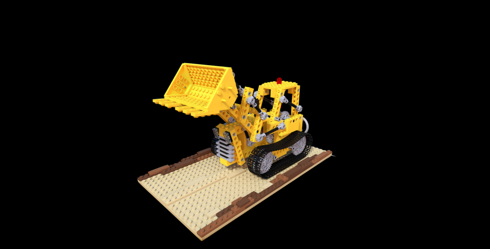
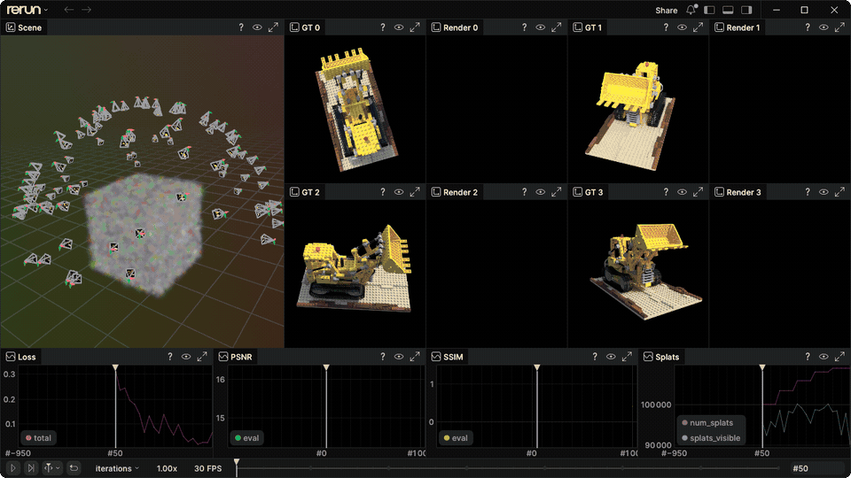

# Gaussian splat renderer

One raw-wgpu core renders PLY scenes in a standalone CLI and native
`GaussianSplats3D` recordings in a custom Rerun viewer. Rust also provides
in-process Brush training, image metrics, and renderer comparisons.
See [architecture](docs/architecture.md) for data boundaries and limitations.

## Build and view

Run tasks from the repository root. Use the prod environment for long runs;
the dev environment adds linting, type checks, and tests.

```bash
pixi run -e gsplat-rust-renderer-dev --frozen gsplat-build
pixi run -e gsplat-rust-renderer --frozen gsplat-download pretrained lego
pixi shell -e gsplat-rust-renderer
cd packages/gsplat-rust-renderer
target/release/gsplat-rust-renderer
```

Activation links the installed `brush-src` package into Cargo's target directory.
Activate an environment once before using bare Cargo or rust-analyzer.
In another activated shell, run `python tools/log_gaussian_ply.py --rr-config.connect`.
Pass `--rr-config.headless` when saving a recording without a display.

The custom viewer selects compute rendering automatically. Stock Rerun selects
its native renderer for the same recording. An explicit compute visualizer
selection requires the custom viewer.



## Train

```bash
pixi run -e gsplat-rust-renderer --frozen gsplat-rust-renderer-train lego 7000 video
```

The task prepares a deterministic initialization, writes checkpoints and
`training.rrd` under `data/brush-runs/`, and exports every 7,000 steps plus the
final step. Modes are `record`, `live`, and `video`; extra Brush flags follow `--`.
NeRF-synthetic and the COLMAP `truck`/`train` scenes are supported. Direct
`target/release/gsplat-train DATASET` runs without recording unless a sink is set.



## Render, score, and compare

From the package directory in an activated shell:

```bash
target/release/gsplat render --ply scene.ply --camera transforms_test.json \
  --output-dir renders --background 0,0,0
target/release/gsplat eval --render renders/test --gt rgb-test --out metrics.json
target/release/gsplat score --ply export_7000.ply --dataset data/nerfbaselines/data/lego --out training-score.json
target/release/gsplat parity --impl ours --ply scene.ply \
  --path transforms_test.json --holdout-every 8 --out parity.json
target/release/gsplat speed --impl ours,brush --ply scene.ply \
  --path orbit:300 --res 1920x1080 --out speed.json
```

The ground-truth directory must contain the matching RGB images, without depth sidecars.
`gsplat score` preserves unclipped float renders for training PSNR; exported PNGs
clip and round RGB and therefore measure a different boundary.
Use `--archetype [RRD]` with parity to measure native archetype quantization.
`gsplat-rust-renderer-evaluate` runs the white-background published-checkpoint
guard; add `--checkpoint-only` to score the bundled predictions.
The [CLI reference](crates/gsplat-cli/README.md) describes camera inputs, metric
conventions, parity evidence, and timing controls.

## Measurements

At training revision `f1dac638`, mean unclipped test PSNR across two scored runs was 32.8540 dB with recording
versus 32.8720 dB for stock Brush. See the
[comparison report](https://pablos-4800gt.ilish-ruler.ts.net:8768/gsplat-modern/report.html)
for evidence and host conditions. These figures identify their measured revisions.

## Check

```bash
pixi run -e gsplat-rust-renderer-dev --frozen gate
pixi run -e gsplat-rust-renderer-dev --frozen tests-golden
```

The gate includes Rust GPU contracts and headless viewer pixels. Golden tests
cover all camera models, native archetype conversion, and published checkpoints.
Missing datasets produce explicit skips. Run `gsplat-download all all` to obtain
the eight Blender datasets and checkpoints.
