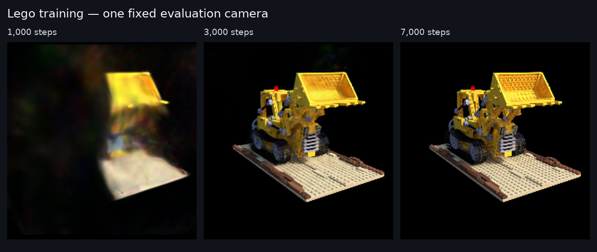
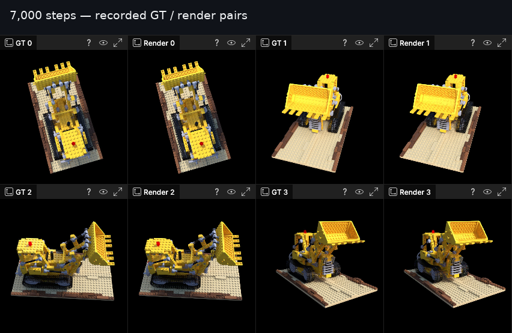

# gsplat-rust-renderer

Train, render, measure, and view Gaussian splats with one shared GPU renderer.
Rust runs pinned [Brush](https://github.com/ArthurBrussee/brush) training in process;
Rerun recordings use native `GaussianSplats3D` and open in either viewer.


Requires Pixi and a supported Vulkan or Metal GPU with subgroups. Run commands
from the repository root. Builds disable incremental compilation and debug symbols
through the package environment. Use the prod environment for long training runs.

## View Lego

```bash
pixi install -e gsplat-rust-renderer-dev --frozen
pixi run -e gsplat-rust-renderer-dev --frozen gsplat-download pretrained lego
pixi run -e gsplat-rust-renderer-dev --frozen gsplat-rust-renderer-viewer
# In another terminal:
pixi run -e gsplat-rust-renderer-dev --frozen gsplat-rust-renderer-log-ply
```

Use `gsplat-rust-renderer-log-scene` to add the dataset cameras and image grid.
The custom viewer listens on port 9876 and selects compute rendering automatically.
The same native recording opens in stock Rerun without a visualizer override.
`--compute --render-mode mip` explicitly selects the custom renderer. In a shell
without a display, add `--rr-config.headless` to Python logging commands; save with
`--rr-config.save scene.rrd`. The custom viewer also supports `--headless`.


## Train

```bash
pixi run -e gsplat-rust-renderer --frozen gsplat-rust-renderer-train lego 7000 video
# Other modes: record, live. Other supported scenes include truck and train.
```

The task prepares a seed-42 initialization and saves checkpoints and `training.rrd`
under `packages/gsplat-rust-renderer/data/brush-runs/lego/7000/video/`. Live mode also
connects to port 9876. Extra Brush flags follow `--`. A 30,000-step run exports at
7,000 steps as well as the final step. Direct `gsplat-train` runs without a sink
skip all recording work. `gsplat-brush-cli-build` builds the pinned upstream CLI
locally for reference runs.




On the RTX 5090, the final quiet-host 7k comparison measured 163.82 steps/s for
stock Brush, 165.04 with recording off, and 165.84 with recording on. This shows no
observed recording slowdown in that set; the small difference is not evidence of
a speedup. Source: `~/gsplat-modern-work/results/w3-5090/final/comparison-quiet.json`
(six ordered runs, Brush `1388f74c`, trainer `f1dac638`). Mean test PSNR across the
two scored runs was 32.8540 dB versus stock 32.8720 dB, from
`~/gsplat-modern-work/results/w3-5090/final/{on,stock}-r{1,2}/eval-float.json`.

## Render and evaluate

```bash
pixi run -e gsplat-rust-renderer-dev --frozen gsplat-rust-renderer-render \
  --ply /path/to/scene.ply --camera /path/to/transforms_test.json \
  --output-dir /tmp/gsplat-renders --width 800 --height 800
pixi run -e gsplat-rust-renderer-dev --frozen gsplat-eval dirs \
  --render /tmp/gsplat-renders --gt /path/to/gt --convention published --out /tmp/metrics.json
# Download and score all eight bundled splits; then render and score them:
pixi run -e gsplat-rust-renderer-dev --frozen gsplat-rust-renderer-evaluate-checkpoints
pixi run -e gsplat-rust-renderer-dev --frozen gsplat-rust-renderer-evaluate
```

Rust owns PSNR/SSIM. `published` matches the 8-bit checkpoint convention;
`brush` uses Brush's convention. `gsplat-train-score` scores unclipped float renders
of an exported PLY against all dataset test cameras. Add `--lpips` to `gsplat-eval`
for Brush's VGG LPIPS model.



## Benchmark

```bash
pixi run -e gsplat-rust-renderer-dev --frozen gsplat-bench speed \
  --impl ours,brush --ply /path/to/scene.ply --path orbit:600 \
  --res 1920x1080 --out /tmp/gsplat-speed.json
```

The harness synchronizes GPU completion and records admission, warmup, rotated
repeats, and stability. These RTX 5090 results are milliseconds (median / p95),
not viewer FPS:

| Scene | Resolution | Shared core | Brush |
|---|---|---:|---:|
| Lego | 1920×1080 | 1.476 / 1.884 | 1.950 / 2.256 |
| Lego | 3840×2160 | 2.672 / 3.124 | 3.233 / 3.859 |
| Garden | 1920×1080 | 4.107 / 4.904 | 4.681 / 5.591 |
| Garden | 3840×2160 | 10.542 / 14.175 | 11.579 / 16.222 |

Sources: `~/gsplat-modern-work/results/w1-5090/final-5f5bc3a2/{lego,garden}-{1920x1080,3840x2160}.json`.
Each cell is the median of three repeat medians/p95s from the final core revision.
See [benchmark conventions](crates/gsplat-bench/README.md) before comparing hosts.

## Gates

```bash
pixi run -e gsplat-rust-renderer-dev --frozen gate
pixi run -e gsplat-rust-renderer-dev --frozen tests-golden
pixi run -e ci --frozen ci
```

`gate` covers lint, types, dead code, Rust unit tests and GPU/viewer integration.
The golden lane checks float parity against Brush, all 1,600 bundled images,
standalone render quality, analytic calibration, and viewer pixels. Missing assets
are reported as skips; inspect that report before claiming a complete gate.
`GSPLAT_MODERN_DATA`, `GSPLAT_TEST_PLY`, and `GSPLAT_LEGO` select local assets.
See [architecture](docs/architecture.md) for formats, GPU limits, and known viewer
constraints. Media here comes from the integrated code; capture details are in
[media provenance](docs/media/README.md).
