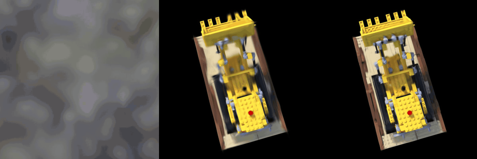

# Architecture

This page describes the current renderer and recording paths. For copy-paste usage, start with the [README](../README.md).

## System shape

```text
Python PLY / Brush sidecar
          │  Rerun 0.34.1 Gaussians3D components over gRPC or RRD
          ▼
┌──────────────────────────────┐       ┌──────────────────────────┐
│ custom Rerun viewer          │       │ standalone gsplat-render │
│ gaussian_visualizer.rs       │       │ render_cli.rs            │
│ gaussian_renderer.rs         │       │ raw wgpu + PNG readback  │
└──────────────┬───────────────┘       └────────────┬─────────────┘
               └───────────────┬────────────────────┘
                               ▼
                     gsplat_core + shared WGSL
```

`gsplat_core` is Rerun-free. Both front ends share its cloud/camera types, bind-group layouts, compute pipelines, buffer helpers, constants, and five compute shaders. The viewer adds a sixth shader to composite the raster texture into Rerun's viewport.

The custom viewer registers its visualizer before attaching live receivers or opening a positional `.rrd`. This matters at startup: the first activated blueprint can resolve `Gaussians3D` immediately, and positional recordings open through Rerun's normal file route rather than landing on the catalog page.

## Upstream `Gaussians3D` wire contract

Released Rerun `0.34.1` does not yet expose a generated Python archetype here, so Python emits custom component batches that exactly match the upstream schema. Rust queries the same field-qualified descriptors.

| Descriptor | Component type | Arrow value | Default |
|---|---|---|---|
| `Gaussians3D:centers` | `Position3D` | `FixedSizeList<Float32, 3>` | required |
| `Gaussians3D:scales` | `Scale3D` | `FixedSizeList<Float32, 3>` | `0.01` per axis |
| `Gaussians3D:quaternions` | `RotationQuat` | `FixedSizeList<Float32, 4>` (`xyzw`) | identity |
| `Gaussians3D:colors` | `Color` | `UInt32` (`0xRRGGBBAA`) | opaque white |
| `Gaussians3D:sh_coefficients` | `SphericalHarmonics3` | `FixedSizeList<Float16, 45>` | absent / DC only |
| `Gaussians3D:show_spherical_harmonics` | `ShowSphericalHarmonics` | scalar `Bool` | `true` |

Fixed-size-list children are named `item` and non-nullable. Color stores the PLY's SH DC term as RGB plus sigmoid opacity; the optional 45 float16 values contain degrees 1–3 in coefficient-major order.

## Viewer frame lifecycle

For every matching entity and frame, `GaussianSplatVisualizer::execute`:

1. Resolves the real eye committed by the `Spatial3DView`.
2. Skips the first camera-less frame and requests a repaint after 100 ms. It does not invent a fallback camera, avoiding the old tiny/misplaced splats that snapped into place after startup.
3. Queries required centers plus every optional component and the entity transform.
4. Hashes Rerun's resolved query rows, the SH toggle, splat count, and transform.
5. Reuses or rebuilds a store memoized `RenderGaussianCloud`, assigning every rebuild a globally unique generation.
6. Submits the full cloud, generation, and camera to the GPU renderer.

The renderer keeps per-entity GPU buffers across camera motion. A generation change reuploads attributes; capacity grows geometrically; entities unused for 600 frames are evicted. On a steady frame the CPU mainly updates the camera uniform and encodes commands.

## GPU compute pipeline

The GPU receives the full cloud; there is no CPU cull or depth sort.

| Stage | Shader / operation | Result |
|---|---|---|
| 1. Cull + compact | `gaussian_project::project_forward_main` | Visible `(global_gid, depth_bits)` pairs via `atomicAdd(num_visible)` |
| 2. Depth argsort | `gaussian_dynamic_sort` | GID canonicalization, then front-to-back radix sort |
| 3. Project | `gaussian_project::project_visible_main` | 2D covariance, SH color, tile bounds, hit counts |
| 4. Scan | `gaussian_project::scan_*` | Three-level prefix sum of tile-hit counts |
| 5. Map | `gaussian_map_intersections::map_main` | One `(tile_id, compact_gid)` per covered tile |
| 6. Clamp + dispatch | `clamp_count_main` | Exact live intersection count and indirect sort dispatch arguments |
| 7. Tile sort | `gaussian_dynamic_sort` | Tile-contiguous intersections; count/scatter dispatch only over the live count |
| 8. Tile offsets | `gaussian_tile_offsets` | `[start, end)` range per tile |
| 9. Raster + composite | `gaussian_raster_tiles`, then viewer composite | Premultiplied raster texture, then a fullscreen triangle |

Rasterization uses one 256-thread workgroup per 16×16 tile, Morton-order pixel assignment, and **64-entry shared-memory splat batches**. Pixels blend front-to-back and stop below transmittance `1e-4`; a cooperative counter stops the whole workgroup once all pixels finish.

The clamp stage stores `DrawIndirectArgs` beside the live count. Viewer tile-radix `sort_count` and `sort_scatter` consume those arguments with `dispatch_workgroups_indirect`, avoiding capacity-sized work on sparse frames. The standalone renderer shares the buffer layout and shader but keeps direct dispatches.

## Shared GPU resources

`gsplat_core/gpu_types.rs` owns 12 bind-group layouts and 13 compute pipelines. Important constants are:

| Constant | Value | Meaning |
|---|---:|---|
| `TILE_WIDTH` | 16 px | Raster tile width and height |
| `PROJECT_WORKGROUP_SIZE` | 128 | Projection threads per workgroup |
| `SORT_WORKGROUP_SIZE` | 256 | Radix-sort threads per workgroup |
| `SORT_BITS_PER_PASS` | 4 | 16 radix bins per pass |
| `INTERSECTION_CAPACITY_MULTIPLIER` | 32 | Initial per-splat intersection capacity |
| `MIN_RADIUS_PX` | 0.35 px | Sub-pixel culling threshold |
| `SIGMA_COVERAGE` | 3.0 | Screen-space bounding radius |
| `BRUSH_COVARIANCE_BLUR_PX` | 0.3 | Brush-matching antialias blur |

`TileProjectedSplat` is 64 bytes. The intersection counter/readback uses a small ring so later frames can grow dense-scene buffers without synchronously stalling the render path.

## Training recordings

The pure-trainer path keeps Brush's embedded Rerun disabled and uses this package's Rerun `0.34.1` sidecar. It logs:

- the true `iterations` timeline plus a dense `step` timeline;
- all 100 training-camera frusta with 160-pixel JPEG ground-truth planes;
- `loss/total`, `psnr/eval`, `ssim/eval`, and `splats/num_splats`;
- four `eval/view_{0..3}/{ground_truth,render}` pairs;
- `world/splats` snapshots with complete geometry and optional higher-order SH.

Both rich blueprints use `GradientDark`, collapsed panels, a 0.2 rad/s orbital eye, and explicit `Gaussians3D` overrides. The normal layout uses a 2×2 eval grid plus Quality tabs and a Splats plot. `--video-layout` removes tabs: all four eval pairs are stacked beside the scene, with four graphs in one bottom row.



The ordinary 7K replay exports every 50 steps, evaluates every 500, and retains eight splat snapshots: 50, 1,000-step boundaries, and 7,000. The dense video task exports and logs every iteration, evaluates every 25 steps, keeps intermediate snapshots DC-only, preserves SH on the final snapshot, and deletes processed PLY/eval batches. Its measured RRD has 7,000 splat timeline points and four tracked eval views.

## Evaluation path

`gsplat-render` loads one PLY and `transforms_test.json`, creates Metal/Vulkan resources once, then reuses them for all cameras. The Python harness pairs outputs by strict relative path and averages per-image PSNR/SSIM after the same 8-bit roundtrip used for checkpoint validation. The checkpoint-only gate first proves the metric implementation against each downloaded prediction/ground-truth split.

## File map

```text
packages/gsplat-rust-renderer/
├── src/
│   ├── main.rs                       custom viewer, headless loop, positional RRD loading
│   ├── gaussian_visualizer.rs        Rerun query, camera lifecycle, CPU cloud cache
│   ├── gaussian_renderer.rs          viewer GPU cache, compute encoding, composite
│   ├── render_cli.rs                 standalone CLI
│   ├── ply_loader.rs                 Rust INRIA PLY parser
│   ├── nerf_camera.rs                NeRF transform parser
│   └── gsplat_core/                  Rerun-free shared renderer
├── shader/                           six WGSL shaders
├── gsplat_rust_renderer/
│   ├── gaussians3d.py                PLY parser and wire batches
│   ├── evaluation.py                 full-split render/eval harness
│   └── apis/                         typed CLI implementations
├── tools/                            thin Tyro entrypoints
├── tests/                            Python tests
└── docs/media/                       real checkpoint and dense-run media
```
