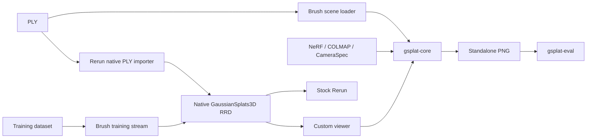

# Architecture

Six workspace crates share the scene and camera contracts. Brush is pinned to
`1388f74c6fe0236f68ee4915564bf00e9d2e3747`; recording and viewer APIs use Rerun
0.38.1. The earlier `src/gsplat_core` and its shaders have been removed.

| Crate | Responsibility |
|---|---|
| `gsplat-core` | Raw wgpu/WGSL forward renderer, immutable scene uploads, per-view scratch |
| `gsplat-render` | PLY loading through Brush, camera loading, standalone PNG rendering |
| `gsplat-eval` | Brush/published PSNR and SSIM, optional VGG LPIPS, typed reports |
| `gsplat-bench` | Brush/core/native comparisons, float scoring, synchronized measurements |
| `gsplat-viewer` | Rerun native-archetype query, shared compute rendering, scene composition |
| `gsplat-train` | In-process Brush training, asynchronous native Rerun observations |

## Data flow

```mermaid
flowchart LR
    PLY[PLY] --> Load[Brush scene loader]
    Load --> Core[gsplat-core]
    Cameras[NeRF / COLMAP / CameraSpec] --> Core
    Core --> PNG[Standalone PNG]
    PNG --> Eval[gsplat-eval]
    Data[Training dataset] --> Train[Brush training stream]
    Train --> RRD[Native GaussianSplats3D RRD]
    PLY --> Import[Rerun native PLY importer]
    Import --> RRD
    RRD --> Stock[Stock Rerun]
    RRD --> Viewer[Custom viewer]
    Viewer --> Core
```

Python provides downloads, initialization, CLI configuration, camera/image logging,
and process orchestration. It does not implement PLY decoding or image metrics.
The PLY logger uses Rerun's importer and chunk reader, renames the native entity to
`/world/splats`, and computes center percentiles for framing. Static PLY scenes keep
their path across file names. Training snapshots retain their iteration timeline; synthetic relog checks retain
their explicit static updates. `scene_io.py` retains the typed NeRF metadata and image compositing needed
by the camera logger; the shared Rust camera loader serves rendering and evaluation.

## Scene and view lifetime

`gsplat-core::Renderer` owns device-lifetime pipelines. A scene upload holds the
splat attributes; several views share that upload. Each `ViewState` owns its scratch,
uniform slots, sort capacity, output, and feedback. Camera movement does not upload
the scene again. GPU feedback reports capacity overflow; the caller grows capacity
and rerenders before accepting a frame.

The custom viewer queries native `GaussianSplats3D` components and transforms,
identifies changes by resolved query rows, and shares scene uploads across views.
Optional component removal, relogging, resizing, and render-mode changes invalidate
the appropriate resources. The renderer uses the eye committed by the spatial view;
the public Rerun hook can introduce a one-frame eye delay. It does not guess an eye
before one exists.

Recordings without overrides remain portable: this viewer chooses
`ComputeGaussianSplats3D`, stock Rerun chooses its native visualizer. An explicit
native selection stays native. Explicit compute selection requires this custom
viewer; stock 0.38.1 provides no warning for an unknown visualizer, so the Python
helper emits that warning when making the selection. Compute mode can be `default` or `mip`, stored in the blueprint.

## GPU pipeline

The GPU performs visibility, sorting, projection, and rasterization. The timed
stage boundaries are:

| Stage | Work |
|---|---|
| `project_forward` | Cull/project candidates and prepare indirect dispatch |
| `depth_sort` | Sort visible splats by depth |
| `gather_scan` | Gather visible data and scan intersection counts |
| `project_visible` | Project covariance, evaluate SH, compute tile coverage |
| `map_intersections` | Emit tile/splat pairs |
| `tile_sort` | Sort live intersections by tile |
| `tile_offsets` | Build each tile's range |
| `rasterize` | Blend sorted splats front to back |

Cameras support pinhole, KB4, RT8, and thin-prism distortion. Mip mode applies
covariance filtering and scale compensation. The standalone path can read unclipped
float RGBA or packed output; PNG export clips and rounds to 8-bit RGB. The viewer
composites the display-referred premultiplied color and optional depth through
Rerun's renderer. Tests cover black and white backgrounds, opaque foreground/rear
geometry, fixed-camera agreement, and analytic calibration. Compute picking, hover, selection outlines, and per-entity focus bounds are not
implemented. Expected depth is an approximation for overlapping depth mixtures.
Entities are not jointly depth-sorted; each instance requires a full render.

Kernels stay within eight storage buffers per stage, at most 256 threads per
workgroup, and 65,535 dispatch groups per axis through 2D dispatch. The optional
depth kernel needs 10,256 bytes of shared memory. Device checks fail with a clear
capability error. Native rendering requires subgroups and sufficient storage limits.
A browser build is not supplied: registry wgpu 30 lacks the needed WebGPU subgroup
mapping. No third-party backport is vendored. A future browser path must enable WGSL
subgroups only on its WebGPU backend; native Naga rejects that directive.

## Native format and precision

The Rerun boundary carries float32 centers/scales, normalized XYZW rotations,
RGBA8 DC color and opacity, and coefficient-major RGB spherical harmonics in f16.
Degree 4 is truncated at this boundary. Brush tensors and the core float comparison
retain their higher-precision representation. Native-archetype PSNR therefore measures
a different loss from float-core parity; do not compare the two as equivalent gates.
The PLY importer owns its native defaults and descriptors.

## Training recordings

`gsplat-train` consumes Brush's `create_process_with_device` stream. It uses
Brush 1388f74c + packages/brush-src/patches/brush-1388f74c-process-observer.patch:
it exposes existing loss, learning-rate, and refinement values without changing
training math, config merging, evaluation, or export. Pixi builds the `brush-src` source package with this patch, and environment activation
links its installed source tree at `target/brush-src` for Cargo's path overrides.
The reference Brush CLI uses an unpatched upstream workspace.

Training passes tensor handles to a separate logging thread before advancing the
stream. Readback and encoding occur there. Scales use exp, rotations change from
WXYZ to XYZW, and Brush's minimum-scale filter is folded as in its exporter.
Observations arrive every five steps; snapshots default to step 50, each 1,000 steps,
and the final step. Only the final snapshot includes higher SH. Override the first
snapshot with `--snapshot-first` and cadence with `--rerun-log-splats-every`; intervals
must be positive multiples of five. Stats keep Brush's 50-step default.

All dynamic data uses `iterations`. The dashboard includes the scene, cameras,
four fixed GT/render pairs, loss, throughput, splat counts, learning rates,
refinement statistics, sampled GPU memory, and Brush evaluation PSNR/SSIM. Eval
thumbnails use a black background and premultiplied GT. Distorted cameras appear as
pinhole approximations. JPEG thumbnails bound recording size. `--video` adds a
spinning eye and a flat metrics row; the eye follows Brush's estimated scene axis.

`--save` and `--connect` fan out identical data. An unavailable live sink is disabled
after a bounded connection check. Recording failures warn without stopping training;
flushes have a two-second timeout. No sink means no logging work. Brush's legacy
Rerun logger remains disabled; its transitive 0.36 dependency does not produce the
0.38.1 recording. `--compute-visualizer` is optional and cannot use stock `--spawn`.

## Evaluation and evidence

The Rust evaluator pairs strict relative paths and averages per-view scores. Published
metrics use the checkpoint's 8-bit convention; Brush metrics and float training scores
use their declared convention. Optional LPIPS uses Brush's VGG model. Python reads typed
reports and keeps full-split render orchestration only.

The test tiers separate synthetic CPU logic, GPU/assets/viewer integration, and
stored-reference/pixel goldens. The nine float-core parity cases compare against
Brush, while eight published fixtures cover 1,600 images. Full render-quality tests
also rerender all 200 views per Blender scene. The viewer's native path has its own
loss, calibration, color, relog, and depth tests. Missing assets are explicit skips.

Current renderer and training measurements, source revisions, and evidence paths are
in the [README](../README.md). Benchmark wall time includes GPU completion; optional
timestamp attribution runs separately. Do not mix diagnostic profiling with the
wall-time lane. Admission samples the GPU and host load; repeat stability is reported
rather than inferred from one frame. See the [benchmark notes](../crates/gsplat-bench/README.md).
