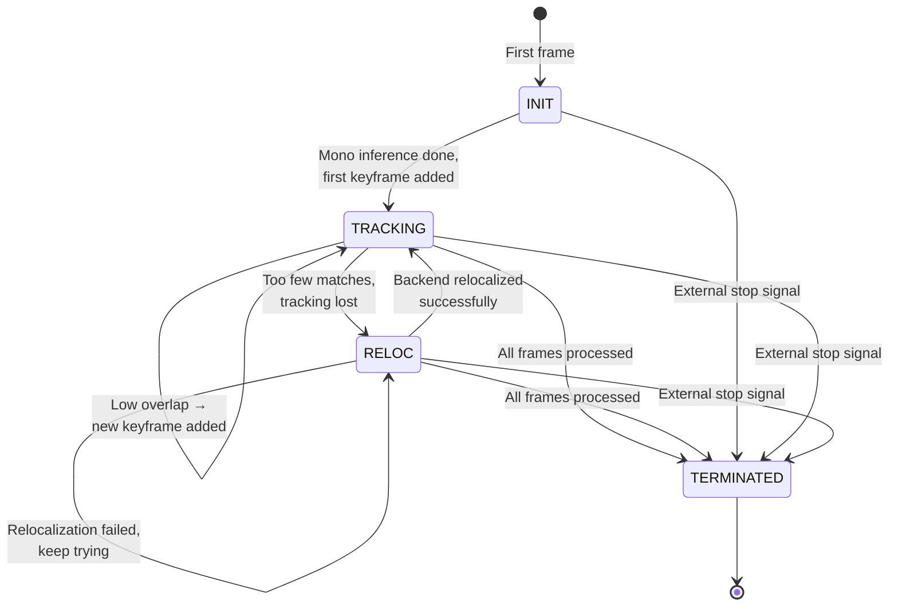
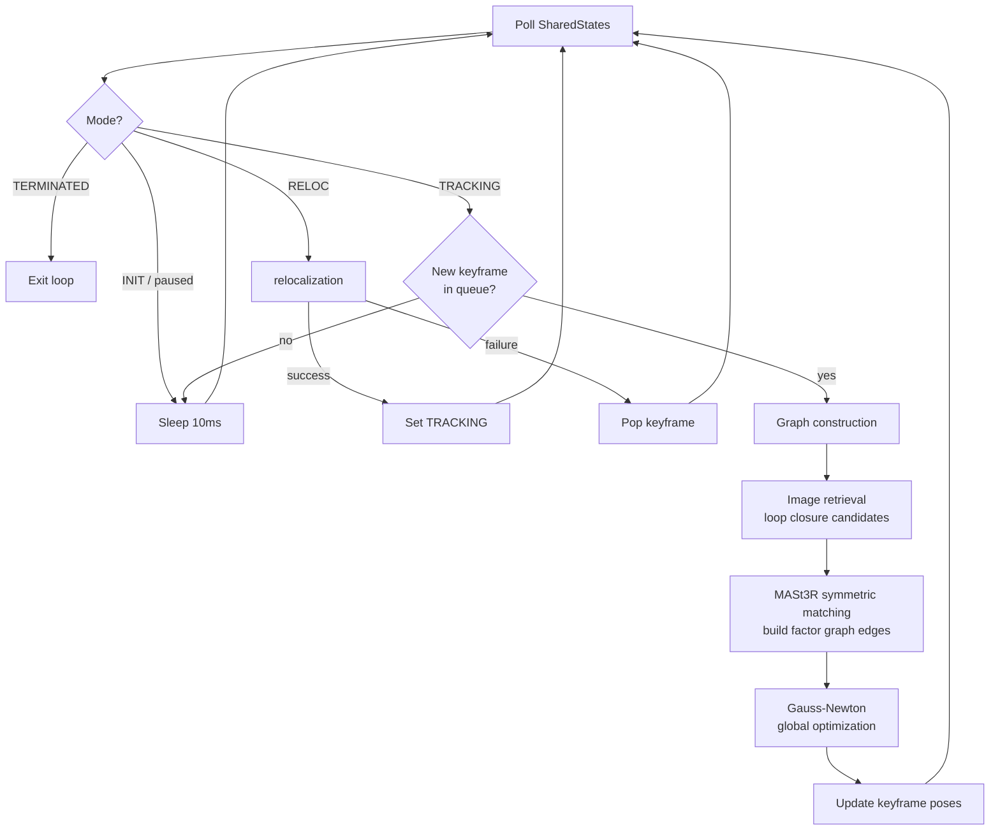
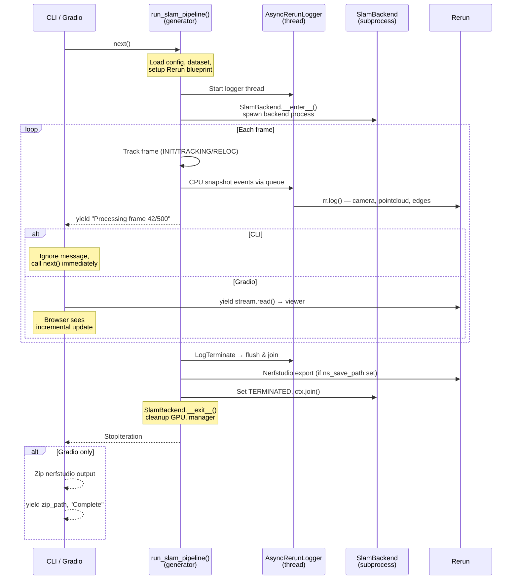
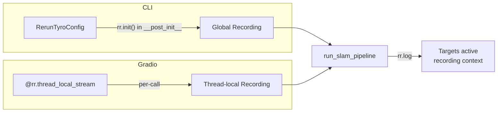
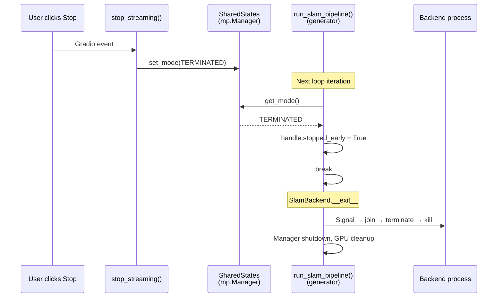

# MASt3R-SLAM Pipeline Architecture

This document explains the MASt3R-SLAM inference architecture: the multi-process SLAM pipeline, the frontend/backend state machine, and how the CLI and Gradio app share a single implementation via a Python generator.

## System Overview

```
┌─────────────────────────────────────────────────────────────────────────────┐
│                         Caller (CLI or Gradio)                              │
│                                                                             │
│  CLI: mast3r_slam_inference()          Gradio: streaming_mast3r_slam_fn()   │
│  ┌───────────────────────────┐         ┌──────────────────────────────────┐  │
│  │ 1. Load model             │         │ 1. Load model (module-level)     │  │
│  │ 2. rr.init() via tyro     │         │ 2. @rr.thread_local_stream       │  │
│  │ 3. for _msg in pipeline:  │         │ 3. for msg in pipeline:          │  │
│  │       pass                │         │       yield stream.read(), msg   │  │
│  │ 4. "Done" log             │         │ 4. Zip nerfstudio output         │  │
│  └───────────┬───────────────┘         └──────────────┬───────────────────┘  │
│              │                                        │                      │
│              └──────────────┬─────────────────────────┘                      │
│                             ▼                                                │
│              ┌──────────────────────────────┐                                │
│              │    run_slam_pipeline()        │  ◄── Generator (yields per    │
│              │    (api/inference.py)         │      frame for streaming)     │
│              │                              │                                │
│              │  Config ─► Dataset ─► Rerun  │                                │
│              │         ─► SlamBackend ctx   │                                │
│              │         ─► Tracking loop     │                                │
│              └──────────────┬───────────────┘                                │
└─────────────────────────────┼────────────────────────────────────────────────┘
                              │
                              ▼
          ┌───────────────────────────────────────────┐
          │           SlamBackend (context manager)    │
          │           backend_lifecycle.py             │
          │                                           │
          │  __enter__: mp.Manager, SharedKeyframes,  │
          │             SharedStates, spawn backend    │
          │  __exit__:  signal TERMINATED, join/kill,  │
          │             manager.shutdown(), GPU cleanup│
          └───────────────────┬───────────────────────┘
                              │ spawns
               ┌──────────────┴──────────────┐
               ▼                              ▼
┌──────────────────────────┐  ┌──────────────────────────────┐
│  Main Process (Frontend) │  │  Backend Process              │
│  run_slam_pipeline()     │  │  run_backend()                │
│                          │  │                                │
│  Frame-by-frame tracking │  │  Global optimization loop     │
│  Pose estimation (GN)    │  │  Factor graph construction    │
│  Keyframe decisions      │  │  Image retrieval (loop close) │
│  CPU snapshots → queue   │  │  Gauss-Newton solver          │
│                          │  │  Relocalization               │
└──────────┬───────────────┘  └──────────────┬─────────────────┘
           │      SharedKeyframes            │
           │      SharedStates               │
           └──────────◄──────────────────────┘
                  (mp.Manager + CUDA IPC)
```

## Frontend State Machine

The frontend (tracking loop in `run_slam_pipeline`) processes frames one at a time. A `Mode` enum controls what happens to each frame:



### Mode Details

| Mode | What happens | Who transitions out |
|------|-------------|-------------------|
| **INIT** | Run MASt3R mono inference on first frame to get 3D points + features. Add as keyframe. | Frontend sets `TRACKING` |
| **TRACKING** | Match frame against last keyframe via `FrameTracker.track()`. Estimate pose with Gauss-Newton. If overlap is low, promote to keyframe and queue for backend. | Frontend sets `RELOC` if too few matches |
| **RELOC** | Run mono inference to get features, then the backend attempts relocalization against the retrieval database. | Backend sets `TRACKING` on success |
| **TERMINATED** | Both processes exit their loops. `SlamBackend.__exit__` handles cleanup. | Frontend (end of video) or external (stop button) |

## Backend Process

The backend runs in a **separate process** (spawned via `mp.Process` with `spawn` start method for CUDA compatibility). It communicates with the frontend through shared-memory objects managed by `mp.Manager`:



### Shared Memory Objects

| Object | Type | Purpose |
|--------|------|---------|
| `SharedStates` | `mp.Manager` values + locks | Mode flag, task queues, current frame data, factor graph edges |
| `SharedKeyframes` | Pre-allocated GPU tensors | Fixed-size buffer (512 KFs) with poses, pointmaps, features, confidences |
| `model` | `AsymmetricMASt3R` | MASt3R weights shared via `share_memory()` (CUDA IPC for GPU tensors) |

## Why a Generator?

The core design challenge: the CLI and Gradio app need the **same tracking loop** but consume it differently.



### Why not just call a function?

A regular function runs to completion before returning. The Gradio Rerun viewer needs **incremental bytes** after each frame so the user sees real-time progress (camera moving, point cloud growing). A generator lets the tracking loop `yield` after each frame, giving Gradio a chance to send `stream.read()` bytes to the viewer, then resume exactly where it left off.

The CLI doesn't need incremental updates, so it just exhausts the generator:

```python
# CLI — silent consumption, unpacks InferenceConfig fields
for _msg in run_slam_pipeline(model=model, dataset_path=inf_config.dataset, ...):
    pass
```

```python
# Gradio — @rr.thread_local_stream sets up per-call recording;
# stream bytes to viewer after each frame
stream = rr.binary_stream()
for msg in run_slam_pipeline(model=model, dataset_path=str(video_path), ...):
    yield stream.read(), None, msg
```

### Generator + Context Manager

Python generators keep `with` blocks alive across yields. The `with SlamBackend(...) as ctx:` inside the generator stays open for the entire tracking loop — the backend process runs continuously while the generator is suspended between yields. When the generator is exhausted (or garbage-collected if the Gradio client disconnects), `SlamBackend.__exit__` fires and handles all cleanup.

## Async Logging

Rerun logging is decoupled from the tracking hot-path via an `AsyncRerunLogger` thread. The pipeline thread creates lightweight CPU snapshots and enqueues them; the logger thread does all the expensive work (JPEG compression, focal estimation, pointmap conversion, `rr.log()` calls). This delivers a **2.73x speedup** on `example-base` with the live viewer (12m17s → 4m30s).

### Event Model

The pipeline produces 4 event types (defined in `log_events.py`):

| Event | When sent | Droppable? |
|---|---|---|
| `LogCurrentFrame` | Every frame | Yes (viewer shows previous frame if dropped) |
| `LogMapUpdate` | New keyframe, backend pose update, edge change, or orient update | No (structural) |
| `LogText` | FPS / status messages | No |
| `LogTerminate` | Pipeline done or stopped | No |

Queue ordering per iteration: `LogMapUpdate` first (if any), then `LogCurrentFrame`. Structural changes are processed before the current camera that references them.

### Why Not a Separate Process?

A thread (not a process) is used because:
- The Gradio recording can be shared directly via `rr.set_thread_local_data_recording()` — a separate process cannot share a `RecordingStream`
- No serialization overhead for CPU numpy arrays (just reference passing via `queue.Queue`)
- The GIL is not a bottleneck: JPEG compression, numpy, and `rr.log()` all release the GIL

## Rerun Recording Context

The logger thread's `rr.log()` calls are **recording-agnostic** — they target whatever recording context the caller established:



| Caller | Recording setup | Logger thread binding | Where data goes |
|--------|----------------|---------------------|-----------------|
| **CLI** | `RerunTyroConfig` calls `rr.init()` in `__post_init__` → global recording | None needed (falls through to global) | RRD file, native viewer, or gRPC stream |
| **Gradio** | `@rr.thread_local_stream("mast3r_slam")` decorator → per-call thread-local recording | `rr.get_thread_local_data_recording()` → pass to logger → `rr.set_thread_local_data_recording()` | `rr.binary_stream()` → `yield stream.read()` → embedded Rerun viewer |

### Why `@rr.thread_local_stream` instead of explicit `RecordingStream`?

The [gradio-rerun-viewer demo](https://github.com/rerun-io/gradio-rerun-viewer/blob/main/demo/app.py) uses `RecordingStream` + `with recording:` context. That pattern crashes with generators because `with recording:` uses `ContextVar`, and Gradio runs each `next()` in a **different async context** — the token from `__enter__` is invalid when `__exit__` runs after a `yield` (`ValueError: Token was created in a different Context`).

`@rr.thread_local_stream` avoids this by using `threading.local()` instead of `ContextVar`. Gradio assigns the same worker thread for all `next()` calls on a given generator, so thread-locals are stable across yields. The decorator creates a fresh recording per call, so concurrent users in different threads still get isolated recordings.

**Important**: the Gradio side must NOT construct a `RerunTyroConfig` — its `__post_init__` calls `rr.init()` + `rr.spawn()`, clobbering whatever recording the decorator set up. This is why `run_slam_pipeline` takes separate parameters instead of `InferenceConfig`.

## Gradio Stop Button

The stop button works through the shared state:



The `SlamPipelineHandle` exposes `states` to the Gradio wrapper, which stores it in a module-level `active_states` global. The stop button callback reads this global to signal termination.

## File Map

```
mast3r_slam/
├── api/
│   └── inference.py            # InferenceConfig, SlamPipelineHandle,
│                                # run_slam_pipeline() (generator),
│                                # mast3r_slam_inference() (CLI entry),
│                                # run_backend(), relocalization(),
│                                # snapshot helpers for async logging
├── gradio/
│   └── mast3r_slam_ui.py       # Gradio UI: streaming callback,
│                                # @rr.thread_local_stream, nerfstudio zip
├── async_logger.py              # AsyncRerunLogger thread (event consumer)
├── log_events.py                # Frozen event dataclasses for async logging
├── backend_lifecycle.py         # SlamBackend context manager
├── tracker.py                   # FrameTracker (frontend pose estimation)
├── global_opt.py                # FactorGraph (backend graph optimization)
├── frame.py                     # Frame, SharedKeyframes, SharedStates, Mode
├── rerun_log_utils.py           # Blueprints, video logging, RerunLogger (legacy)
├── mast3r_utils.py              # Model loading, mono inference, matching
├── retrieval_database.py        # Image retrieval for loop closure
├── nerfstudio_utils.py          # Keyframe → NerfStudio format export
└── config.py                    # YAML config loader
```
