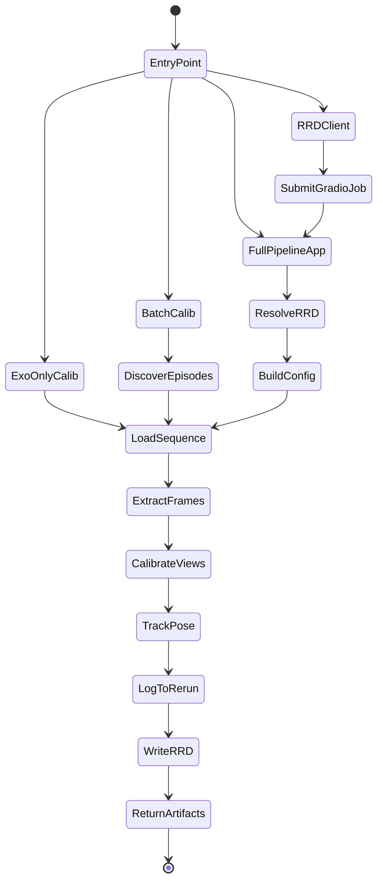

# mv-api State Machine

## First-Pass Workflow

## Script Inventory

| Script | Main API | Inputs | Outputs |
| --- | --- | --- | --- |
| `tools/app_full_pipeline_rrd.py` | `build_full_pipeline_rrd_block()` | uploaded or local `.rrd`, optional `max_frames` | temporary output `.rrd` streamed to embedded Rerun viewer |
| `tools/run_rrd_client_example.py` | Gradio `/run_rrd_pipeline` endpoint | Gradio URL, `.rrd` path, optional `max_frames` | queued job submission plus output `.rrd` path |
| `tools/run_exo_only_calib.py` | `mv_api.api.exo_only_calibration.main()` | dataset config + calibration config via Tyro | calibration logs and optional saved `.rrd` |
| `tools/batch_exo_calib_client.py` | `run_batch_calibration()` | sequence path or cut root | calibrated episode `.rrd` files and manifest updates |
| `tools/validate_mv_api.py` | validation harness | installed package environment | import, CLI help, and app-construction checks |

## Inputs and Outputs

- `full_exoego_pipeline.py`
  - Input: calibrated or calibratable exo/ego `.rrd` capture
  - Output: logged pose, cameras, and optional fused geometry in a new `.rrd`
- `exo_only_calibration.py`
  - Input: single `.rrd` episode plus frame-selection / calibration options
  - Output: aligned exo camera poses, triangulated body keypoints, optional saved `.rrd`
- `batch_calibration.py`
  - Input: directory tree of episode `.rrd` files
  - Output: per-episode calibrated `.rrd` files and manifest state

## Non-Goals in This Import

- Labeling workflow state and callbacks
- Face blurring and transcoding flows
- Hand-only and video-only auxiliary pipelines
- Upstream standalone packaging and Docker workflows
