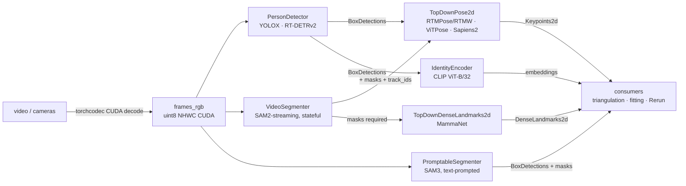
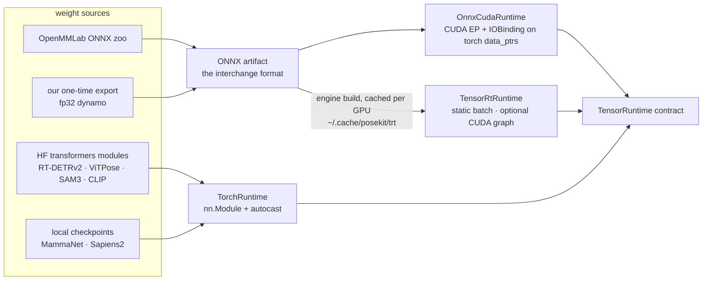

# posekit

One model API for human-centric perception networks — detection, segmentation,
tracking, re-ID, 2D pose, dense landmarks — over **PyTorch, ONNX Runtime, and
TensorRT**, with everything (video decode included) staying on the GPU.

It replaces the five near-copies of bbox→crop math, heatmap/SimCC decoders,
and hand-rolled TensorRT runners that lived in sapiens2-pose,
sapiens-coco133-pose, mamma, wilor-nano, and rtmlib's CPU path.

## How it fits together

Models are grouped into **roles** — the swap points of a pipeline. Every role
consumes the same canonical batch (uint8 RGB NHWC CUDA tensors, straight from
torchcodec's CUDA decoder) and returns GPU-resident predictions:



Any `BoxDetections` producer feeds any top-down consumer — that's what makes
detector, tracker, and pose independently swappable (see `docs/design.md` §2
for why one-stage nets like RTMO/RF-DETR get their own `InstancePose2d` role
instead).

Inside every model class the backend is orthogonal: GPU preprocessing and GPU
decode are shared torch ops, and only the middle — a pure CUDA-tensors-in /
CUDA-tensors-out function — swaps between backends. Weights arrive from three
kinds of sources:



transformers is a **weights source, never a fourth backend**: posekit loads the
`nn.Module` and keeps its own GPU pre/post (the HF image processors are
CPU/PIL-bound).

## Quickstart

Backend choice is config, not code:

```python
from posekit.models import RtmPoseConfig, YoloxDetectorConfig
from posekit.runtimes import TensorRtBackendConfig

detector = YoloxDetectorConfig().setup()
pose = RtmPoseConfig(variant="rtmw-x-coco133", backend=TensorRtBackendConfig()).setup()

detections = detector(frames_rgb)          # uint8 NHWC CUDA in
keypoints = pose(frames_rgb, detections)   # Keypoints2d out, still on GPU
```

Or grab a named preset (`posekit.zoo` — rtmlib's solutions as typed data):

```python
from posekit.zoo import preset
pair = preset("wholebody")   # body / body-performance / wholebody / body-nmsfree / wholebody-fullframe
```

CLI (tyro subcommand unions — model and backend picked per stage):

```bash
# detector backend → pose model → pose backend
pixi run -e posekit --frozen posekit-video-pose --video-path video.mp4 \
    tensorrt rtmpose --variant rtmw-x-coco133 tensorrt

# same demo, transformers-sourced models
pixi run -e posekit --frozen posekit-video-pose --video-path video.mp4 rtdetr vitpose

# detect → SAM2 track → pose → CLIP re-ID, streaming (~38 fps end to end)
pixi run -e posekit --frozen posekit-video-track --video-path video.mp4
```

## Click-to-track app (SAM2 + Rerun)

A Gradio app for single-object video segmentation: upload a clip, click the object in
the embedded Rerun viewer, refine on any frame, and propagate the mask through the clip.

```bash
pixi run -e posekit --frozen posekit-track-app            # http://127.0.0.1:7870
pixi run -e posekit --frozen posekit-track-app --port 7870 --variant efficienttam-s-512
```

The embedded viewer needs a secure context; on the tailnet expose it with
`tailscale serve --bg --https=7870 http://127.0.0.1:7870` and open
`https://<host>.<tailnet>.ts.net:7870/` (served at `/`, so `--root-path` stays empty).
Run it in a shell without `DISPLAY`: the app never spawns a native viewer.

Using it:

- **Click** the object in the viewer at the current frame (`+ Include`); `− Exclude` and
  `✕ Remove` add negative points / delete the nearest point. Pause the viewer before
  clicking — while it plays the click's frame is unknown. Scrubbing shows a memory-conditioned
  preview of the current mask.
- **Track** propagates from the first prompted frame forward, then backward to frame 0, and
  streams masks plus per-frame confidence traces. Clicking again after a track refines it;
  Track re-runs from the kept prompts.
- **Config** tab: model (`efficienttam-s-512` default, `-ti-512` faster), SAM2 memory window,
  point-removal radius, and "re-segment" (clicks replace the object instead of refining it).
  Model and memory window reload the clip and clear the points.
- **Outputs** tab: after a track, download a self-contained `.rrd` (video, prompts, masks,
  confidence). Masks are logged at 1/4 resolution under a `Transform3D(scale=4)` on
  both `video/mask` and `video/preview`; apply it when reading them back.

H.264 input passes through unchanged. HEVC input in MP4 or MOV is transcoded to H.264,
using the GPU when available, so browsers can decode it. Other codecs depend on Rerun
`Mp4Reader` support; MPEG-4 Part 2 (`mp4v`) is not supported and fails at load.

## What runs today, and how well

Every implementation is parity-validated against its reference:

| Model | Role | Backends | Validated vs | Result |
| --- | --- | --- | --- | --- |
| YOLOX (HumanArt) | `PersonDetector` | onnx · trt | rtmlib | boxes ≤ 4 px |
| RT-DETRv2 | `PersonDetector` | torch | HF processor | ≤ 0.31 px |
| RTMPose / RTMW | `TopDownPose2d` | onnx · trt | rtmlib | 1.3 px mean |
| ViTPose | `TopDownPose2d` | torch | HF processor | 0.75 px mean |
| Sapiens2 pose | `TopDownPose2d` | torch · onnx · trt | fp32 torch | < 1 px (bf16 TRT) |
| SAM3 | `PromptableSegmenter` | torch | HF processor | mask IoU ≥ 0.997 |
| SAM2/EfficientTAM | `VideoSegmenter` | torch | — | stable 30-frame track, IoU ≥ 0.97 |
| CLIP ViT-B/32 | `IdentityEncoder` | torch | PIL pipeline | cosine ≥ 0.985 |
| MammaNet (in mamma) | `TopDownDenseLandmarks2d` | torch | mamma estimator | bitwise-equal |

Adoption: **mv-api**'s `MultiviewBodyTracker` runs on posekit roles (batched
per tick, 0.3–0.6 px vs its old rtmlib path, roles injectable via
`detector=`/`pose=`); **mamma** provides the MammaNet role adapter
(`mamma.landmarks.posekit_role`). Per-milestone numbers:
[`docs/implementation-notes.html`](docs/implementation-notes.html); full
inventory, paradigm taxonomy, and roadmap: [`docs/design.md`](docs/design.md).

## Predictions

Flattened across the frame batch with `frame_indices`, on the inference device,
numpy only at the Rerun/serialization boundary (`xy_numpy()`):

- `BoxDetections` — `xyxy`, `scores` (+ optional `masks`, `track_ids`) — one
  type for detector, tracker, and segmenter output.
- `Keypoints2d` — `xy`, `scores`, and its `KeypointSkeleton` (+ optional
  `uncertainty`), so consumers never guess what index 17 means.
- `DenseLandmarks2d` — xy + log-variance + visibility + contact heads.
- `Keypoints3d` — sparse 3D (image xy + root-relative z), for Phase 4.

## Gotchas

- **MMDeploy detector zips** bake `TopK(k=5000)`+NMS (batch-1 only, TRT rejects
  K > 3840). `artifacts.strip_detector_nms` cuts the graph before the TopK
  cluster; thresholding + torchvision NMS run on GPU instead.
- **Sapiens fp16 TRT overflows** (~70 px error). posekit exports fp32 (dynamo
  exporter required) and builds **bf16** engines; a requested fp16 config is
  rewritten with a notice.
- **Export outside dev mode** (`-e posekit`, not `-e posekit-dev`):
  `torch.onnx.export` tracing violates beartype hints in instrumented packages.
- **Compare pose backends on confident keypoints only** (score > 0.3) —
  low-confidence argmax noise inflates pixel errors ~100×.

## Adding a network

1. **Weights** — zoo ONNX (`fetch_openmmlab_onnx`), HF `from_pretrained`
   module, or a one-time fp32 dynamo export.
2. **Crops** — a `CropSpec` (size, `udp`/`cv2` align, BGR flag, mean/std);
   `ops.crops.crop_frames` does the batched `grid_sample` on GPU.
3. **Decode** — `decode_udp_heatmaps`, `decode_classic_heatmaps`,
   `decode_simcc`, or a new GPU decoder in `ops/`.
4. **Model class** — config dataclass with `setup()` implementing the matching
   role ABC; register it in the `posekit.models` tyro union and `posekit.zoo`.
