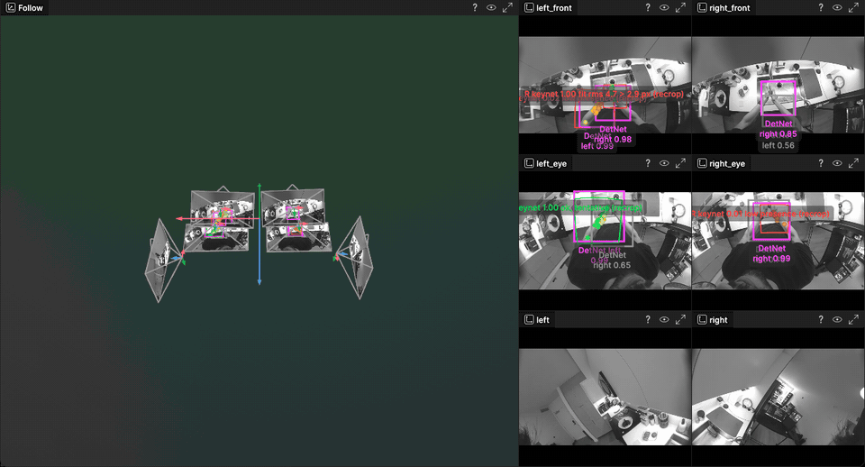
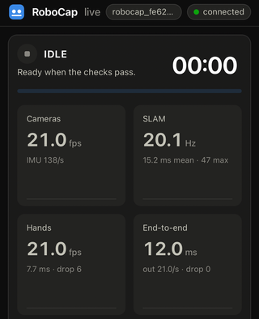

# robocap-live

Live SLAM and hand tracking on a RoboCap: six cameras and an IMU in, [Rerun](https://rerun.io/) out. It runs on the cap (RK3588) and replays recorded clips on a PC.

<p align="center">
  
</p>

## Try it

From the monorepo root, on Linux:

```bash
pixi run -e robocap-live --frozen robocap-live-demo
```

This downloads a 5 s clip (640 MB, [Hugging Face](https://huggingface.co/datasets/pablovela5620/robocap-live-sample)), builds robocap-live, runs SLAM and hand tracking on the clip and opens the result in Rerun.

## Run it on a cap



1. Build and copy it to the cap. This needs `robocap-ssh` to reach the cap, the RKNN models ([models/MODELS.md](models/MODELS.md)) and the display asset from the demo's download:
   ```bash
   pixi run -e robocap-cross --frozen robocap-live-build-arm
   pixi run -e robocap-cross --frozen robocap-live-deploy --cap b --models <rknn dir> --display data/robocap-live-sample/robocap-live-display.rrd
   pixi run -e robocap-cross --frozen robocap-live-panel install-boot --cap b   # once: the cap starts the panel at boot
   ```
2. Start `rerun` on your computer.
3. On your phone, join the cap's Wi-Fi hotspot and open http://192.168.11.1:8090. Enter your computer's name and press **Start run**.
