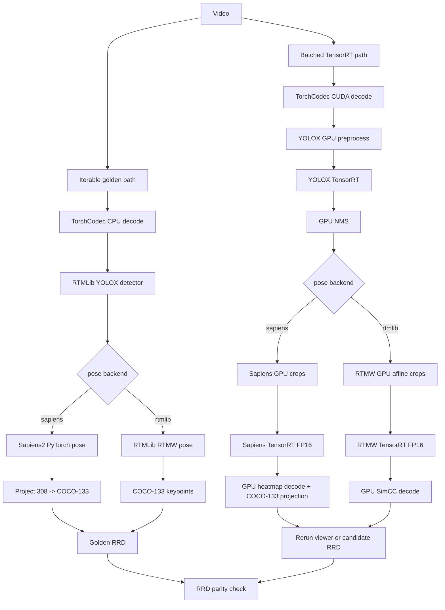

# Sapiens / RTMLib COCO-133 Pose

Human pose package that pairs MV-API's RTMLib YOLOX HumanArt detector with a switchable COCO WholeBody 133 pose backend:

- `sapiens`: Sapiens2 0.4B pose, projected from native 308 keypoints to COCO-133.
- `rtmlib`: MV-API's RTMLib RTMW wholebody pose path, which already emits COCO-133.

The non-batched iterable path writes the golden `.rrd` artifact. The TensorRT video path uses the standard `RerunTyroConfig`, so it opens the viewer by default and can save an `.rrd` with `--rr-config.save`. Source video is logged once at `video`, and pose overlays are logged on stable `video/person_*` entities over the `video_time` timeline. It keeps decode, detector preprocessing, detector inference, pose crops, pose inference, and pose decode on the GPU until final Rerun logging.



| Stage | Iterable golden | Batched TensorRT |
| --- | --- | --- |
| Video decode | CPU | GPU |
| YOLOX preprocessing | CPU/OpenCV inside RTMLib | GPU Torch |
| YOLOX inference | ONNX Runtime/OpenCV via RTMLib | TensorRT |
| Detector NMS | RTMLib backend | GPU TorchVision NMS |
| Sapiens pose crop | PyTorch runtime path | GPU Torch |
| Sapiens pose inference | PyTorch | TensorRT FP16 |
| RTMLib pose crop | RTMLib OpenCV affine | GPU Torch affine |
| RTMLib pose inference | ONNX Runtime/OpenCV via RTMLib | TensorRT FP16 |
| Pose decode | Backend runtime | GPU Torch, then CPU arrays for Rerun logging |
| Artifact write | CPU Rerun SDK | CPU Rerun SDK |

Typical video flows:

```bash
pixi run -e sapiens-coco133-pose --frozen sapiens-coco133-pose-iterable-video \
  --video-path /path/to/video.mp4

pixi run -e sapiens-coco133-pose --frozen sapiens-coco133-pose-iterable-video \
  --video-path /path/to/video.mp4 \
  --pose-backend rtmlib

pixi run -e sapiens-coco133-pose --frozen sapiens-coco133-pose-video-trt \
  --video-path /path/to/video.mp4

pixi run -e sapiens-coco133-pose --frozen sapiens-coco133-pose-video-trt \
  --video-path /path/to/video.mp4 \
  rtmlib

pixi run -e sapiens-coco133-pose --frozen sapiens-coco133-pose-video-trt \
  --video-path /path/to/video.mp4 \
  --rr-config.save /tmp/sapiens_coco133/batched_tensorrt.rrd \
  --rr-config.headless

pixi run -e sapiens-coco133-pose --frozen sapiens-coco133-pose-export-pose-onnx \
  --config.checkpoint-path /path/to/sapiens2_0.4b_pose.safetensors \
  --config.onnx-path /tmp/sapiens_coco133/sapiens2_0.4b_b8_fp16.onnx \
  --config.batch-size 8
```

Typical RTMLib RTMW TensorRT build and benchmark:

```bash
pixi run -e sapiens-coco133-pose --frozen sapiens-coco133-pose-build-trt \
  --config.target rtmlib-pose \
  --config.onnx-path ~/.cache/rtmlib/hub/checkpoints/rtmw-dw-x-l_simcc-cocktail14_270e-256x192_20231122.onnx \
  --config.engine-path /tmp/sapiens_coco133/rtmw_256x192_b32_fp16.trt \
  --config.input-name input \
  --config.output-names simcc_x simcc_y \
  --config.input-shape 3 256 192 \
  --config.batch-size 32

pixi run -e sapiens-coco133-pose --frozen sapiens-coco133-pose-benchmark \
  --config.video-path /path/to/video.mp4 \
  --config.detector.engine-path /tmp/sapiens_coco133/yolox_humanart_head_b8_fp16.trt \
  --config.output-dir /tmp/sapiens_coco133/rtmlib_benchmark \
  --config.max-frames 480 \
  --config.runtime.detector-batch-size 8 \
  --config.runtime.pose-batch-size 32 \
  rtmlib \
  --engine-path /tmp/sapiens_coco133/rtmw_256x192_b32_fp16.trt
```

The benchmark writes `rtmlib_iterable_golden.rrd` and `rtmlib_batched_tensorrt.rrd`, compares those RRDs directly, and reports inference speed. On the 480-frame validation clip, the RTMLib TensorRT no-logging path measures about 750-760 FPS end-to-end; small RRD comparison runs stay above the 10x speedup target.

The short `video-trt` command assumes the default Sapiens preset:

- detector engine: `pretrained_models/tensorrt/yolox_humanart_head_b8_fp16.trt`
- pose engine: `pretrained_models/tensorrt/sapiens2_0.4b_b8_fp16.trt`
- Rerun output: viewer by default, or RRD via `--rr-config.save`
- tqdm progress: enabled by default
- detector static/input metadata: fixed internally for the shipped engine
- detector runtime batch: `8`
- pose runtime batch: selected pose engine static batch unless `--runtime.pose-batch-size` is set

The short `iterable-video` command writes `/tmp/sapiens_coco133/iterable_golden.rrd` by default and enables tqdm progress by default. Override with `--rrd-path`.

For `video-trt`, the RTMLib preset switches to:

- pose engine: `pretrained_models/tensorrt/rtmw_256x192_b32_fp16.trt`
- pose static/input metadata: fixed internally for the shipped engine
- pose runtime batch: `32`
- pose input/output binding names are fixed internally as `input`, `simcc_x`, and `simcc_y`
