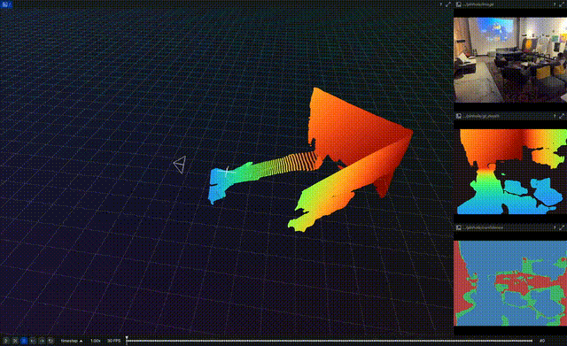

# Simple CV
Utility Computer Vision functions that I often use
<p align="center">
  
</p>

## Install
This package lives inside the examples monorepo. From the repository root:
```bash
pixi run -e simplecv-dev --frozen tests
```

With direnv enabled, `cd packages/simplecv` activates `simplecv-dev`.

## Run Examples
### See all avaiable tasks
```bash
pixi task list -e simplecv
```

### Rerun Environment
The standard `simplecv` environment uses the released `rerun-sdk==0.34.1` with
the `datafusion` extra requested by `simplecv`.

The catalog runs on the `simplecv-catalog` environment, which explicitly adds
the `datafusion` and `dataloader` extras through the shared `rerun-prerelease`
feature. It currently uses the same release as the rest of the workspace. See
the root `AGENTS.md` "Testing Rerun builds" section for how to test an
unreleased build.

#### Full ExoEgo Forge catalog (2-tier serve + register)
Serve an empty catalog, then register the raw RRD roots into it; no `rerun rrd optimize` pre-pass is required.

```bash
# Tier 1 — serve (leave running; the task sets `ulimit -n 524288` for the 6332-RRD catalog):
pixi run -e simplecv-catalog --frozen simplecv-catalog-serve

# Tier 2 — register, in another shell:
pixi run -e simplecv-catalog --frozen simplecv-catalog-register        # v1 root (flat layout)
pixi run -e simplecv-catalog --frozen simplecv-catalog-register-rig    # rig root (exoego:v2), -rig entries
```

Expected local catalog URL:

```text
rerun+http://127.0.0.1:9988
```

When reingesting EPFL Smart Kitchen for this catalog, write to the shared `/mnt/8tb` catalog root, not a repo-relative `data/` directory:

```bash
pixi run -e simplecv --frozen python tools/batch_raw_to_rrd.py \
    --rrd-save-dir /mnt/8tb/data/exoego-forge-catalog \
    --max-conversions None \
    --force \
    --no-log-mano-vertex-normals \
    epfl-smart-kitchen
```

That command writes under `/mnt/8tb/data/exoego-forge-catalog/epfl-smart-kitchen/{train,test}/...` and intentionally omits MANO vertex normals.

#### Known catalog data issues

- `hocap/subject_1/20231025_170650.rrd` is not label-complete. The exo video streams run to about `24.666667s`, but ego/2D/3D label streams only run to about `7.633333s`; avoid using this sequence for label-complete validation or timeline screenshots.

### Visualize Polycam Data
Quick example
```
pixi run -e simplecv --frozen simplecv-view-polycam-data
```

If you have a Polycam zip file or extracted directory:
```
pixi run -e simplecv --frozen python tools/view_polycam.py --polycam-zip-path $PATH-TO-POLYCAM-ZIP
```

### MAMMA dataset (exo-only multi-view)

[MAMMA](https://mamma.is.tue.mpg.de/) is a markerless multi-person mocap dataset. It is
brought in as an **exo-only** ExoEgo dataset (a rig of static IOI/iPhone cameras, no ego
device), with per-camera calibration in NPZ (`cam_int` K, `cam_ext` world→cam) and
per-person SMPL-X fits under `pred/params_XX.npz`.

Downloads are license-gated — register at <https://mamma.is.tue.mpg.de/register.php>, then:

```bash
export MAMMA_USERNAME='your_email'
export MAMMA_PASSWORD='your_password'

# One sequence per subset (dance, multi-people, iphone, eval, syn) into packages/simplecv/data/mamma/:
pixi run -e simplecv --frozen simplecv-download-mamma

# Re-encode the shipped yuv444 videos to AV1 yuv420 (videos_av1/ mirror) for the NVDEC/rerun hot path:
pixi run -e simplecv --frozen simplecv-preprocess-mamma

# View one sequence (defaults to the iPhone crossing_arms scene; SMPL-X meshes logged under /world/gt/smplx):
pixi run -e simplecv --frozen simplecv-view-exoego-data mamma
pixi run -e simplecv --frozen python tools/view_exoego.py mamma --sequence-name mamma_eval_singles/230929_WhiteRabbit_CatchBall_50048_1
```

MAMMA ships 4:4:4-chroma H.264/H.265 videos, which NVDEC and the Rerun viewer cannot decode
on the fast path; `simplecv-preprocess-mamma` builds the AV1 `yuv420p` mirror the loader
prefers automatically. Use `--cq` (constant-quality target, default 30; maps to NVENC `-cq` /
SVT-AV1 `-crf`) and `--encoder {av1_nvenc,libsvtav1}` to tune it.

### Ingest Exo/Ego Recordings
Ingest synchronized exo/ego captures into Rerun (spawns the viewer unless told otherwise).
```bash
simplecv-ingest-exoego --exoego-dir data/exoego-examples/adil-correct/adil3/
```

#### Handy flags
- `--reencode-to-av1` ensures every clip is resized to ≤720p and re-encoded to AV1 MP4 before logging.
- `--rr-config.headless` disables the Rerun UI (useful for automated runs).
- `--rr-config.connect` or `--rr-config.serve` reuse an external/remote Rerun viewer.

The CLI is Tyro-based, so tab completion and `--help` are available by default.

### Video Cache
Visualizing RRD-based exo/ego datasets remuxes the embedded video streams once and caches the resulting MP4s under `~/.cache/simplecv/exoego_videos`. Subsequent runs reuse these files, eliminating the 30 s+ extraction hit per recording.

- Set `SIMPLECV_VIDEO_CACHE=/path/to/cache` to override the cache root (for example, to keep it on a faster disk).
- Set `SIMPLECV_VIDEO_CACHE_DISABLE=1` to opt out entirely; the remux step will run every time.
- The cache auto-invalidates if the source `.rrd` changes (mtime or size). To reclaim disk space manually, delete the directory shown above.

### Video Decode Format Tradeoffs
For the current TorchCodec CUDA default, benchmark summary, and fallback checks, see [docs/video_decode_format_tradeoffs.md](docs/video_decode_format_tradeoffs.md).

### Batch Processing ExoEgo from S3

Process multiple ExoEgo sequences from S3 in batch. The pipeline downloads, cuts, and optionally ingests recordings.

**Environments:**
- Use `simplecv` for NVENC AV1 encoding (requires RTX 40+ GPU)
- Never use `simplecv-dev` for batch (beartype slows processing)

**Cut Only (download + cut videos):**
```bash
pixi run -e simplecv --frozen python tools/exoego_tools/batch_process_s3.py \
    --s3-bucket YOUR_BUCKET_ID \
    --profile YOUR_AWS_PROFILE \
    --output-dir /path/to/output \
    --parallel-workers 4 \
    --cut-only
```

**Full Pipeline (cut + ingest to RRD):**
```bash
pixi run -e simplecv --frozen python tools/exoego_tools/batch_process_s3.py \
    --s3-bucket YOUR_BUCKET_ID \
    --profile YOUR_AWS_PROFILE \
    --output-dir /path/to/output \
    --parallel-workers 4
```

**Re-ingest Only (regenerate RRDs from cut data):**
```bash
pixi run -e simplecv --frozen python tools/exoego_tools/batch_process_s3.py \
    --s3-bucket YOUR_BUCKET_ID \
    --profile YOUR_AWS_PROFILE \
    --output-dir /path/to/output \
    --reingest-only
```

**State Management:**
- Progress tracked in `manifest.json` in output directory
- Ctrl+C is safe - restart resumes from last checkpoint
- Completed sequences are skipped on restart


## Notation for Transformation Matrices

__TL;DR:__ `world_T_cam == world_from_cam`  
This repo uses the notation "cam_T_world" to denote a transformation from world to camera points (extrinsics). The intention is to make it so that the coordinate frame names would match on either side of the variable when used in multiplication from *right to left*:

    cam_points = cam_T_world @ world_points

`world_T_cam` denotes camera pose (from cam to world coords). `ref_T_src` denotes a transformation from a source to a reference view.  
Finally this notation allows for representing both rotations and translations such as: `world_R_cam` and `world_t_cam`
