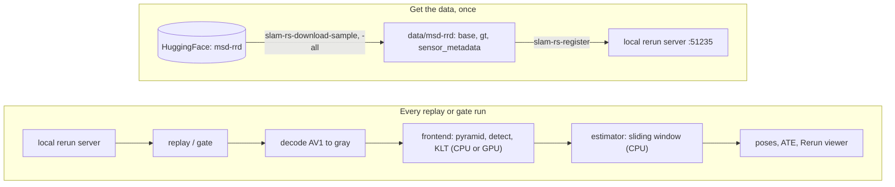
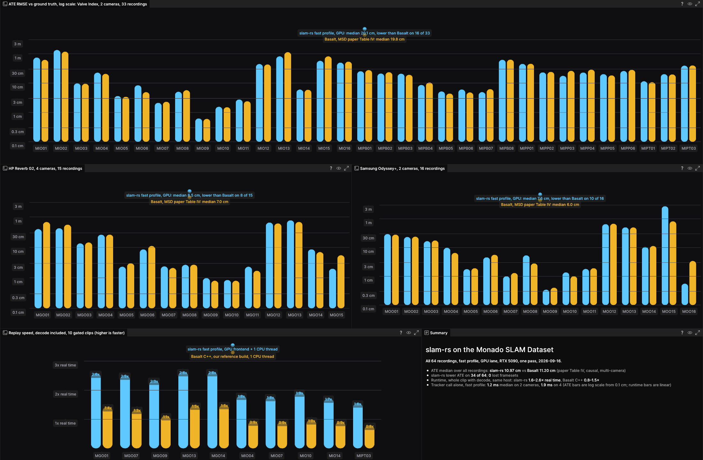
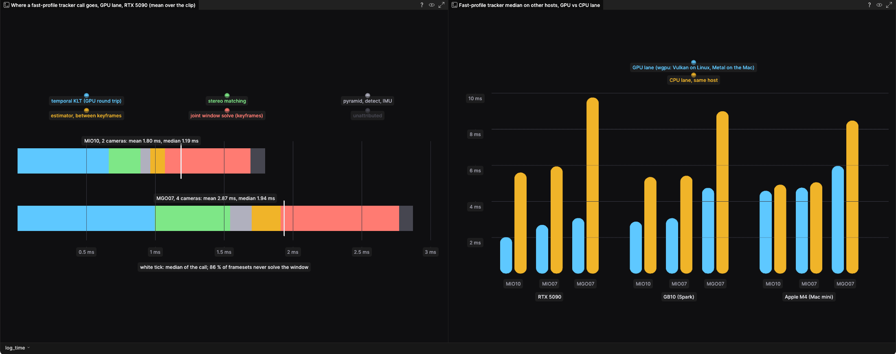

# slam-rs

<p align="center">
  
</p>

Visual-inertial odometry in Rust: any number of cameras, a CPU frontend and a
portable GPU frontend through CubeCL and wgpu (Vulkan, Metal, DX12), driven from
Python through a PyO3 module. It reads Rerun recordings from a local Rerun
catalog and draws its estimate against ground truth in the viewer. Runs on
Linux x86-64, Linux aarch64 and macOS arm64.

## Quickstart

```bash
git clone https://github.com/rerun-io/examples-monorepo.git
cd examples-monorepo/packages/slam-rs
pixi run -e slam-rs slam-rs-demo
```

One command: it builds the core (about two minutes the first time), fetches
three short recordings of the
[Monado SLAM Dataset](https://huggingface.co/datasets/pablovela5620/msd-rrd)
(about 50 MB), starts a local Rerun catalog, registers them, and opens the
four-camera G2 clip from the gif above in the viewer, the estimate drawn
against ground truth. The terminal prints the ATE when the clip ends. You need
[pixi](https://pixi.sh), a screen, and Linux. The catalog stays running for
the next run.

Then, when you want more:

```bash
pixi run -e slam-rs slam-rs-gate --tier smoke      # score the two short smoke clips against the checked-in baselines
pixi run -e slam-rs slam-rs-download-all           # all 64 recordings, 15.5 GB
pixi run -e slam-rs slam-rs-register               # picks up the new files; idempotent
pixi run -e slam-rs slam-rs-gate --tier release    # three longer clips; --tier listed scores the other five
pixi run -e slam-rs slam-rs-wgpu-build             # the GPU frontend; then --gpu on any tool
pixi run -e slam-rs python tools/apps/replay.py --stage vio --rrd base.rrd --gt-rrd gt.rrd   # your own recording, no catalog
```

The gate prints the ATE beside the baseline and pass or fail; on a host that
recorded no baseline the speed clause is reported, not gated. `slam-rs-serve`
starts the catalog by hand in its own terminal; registrations live in memory,
so register again after a restart. On macOS use `-e slam-rs-osx`: the core,
the GPU frontend and the `--rrd` replay work there, the catalog step does not,
because registration goes through dataforge, which is Linux only. More in
[docs/reproduce.md](docs/reproduce.md).



The catalog serves the encoded video and the sensor streams; slam-rs decodes
them itself and the estimator only ever sees grayscale framesets and IMU samples.

### Use slam-rs from another repo

The package is a pixi-build source dependency with two outputs. A Vio-only consumer needs the core:

```toml
[workspace]
preview = ["pixi-build"]

[dependencies]
python = "3.12.*"
slam-rs = { git = "https://github.com/rerun-io/examples-monorepo", subdirectory = "packages/slam-rs" }
```

`pixi install` compiles the Rust core once per checkout (about a minute on a workstation) and installs
`slam_rs` with `_core`, `rig`, `frontend_log`, `config` and `machine`, which import only numpy,
jaxtyping, pyserde and rerun-sdk (0.37 or later). Add `slam-rs-catalog` from the same source for the
catalog readers, `tracking`, `vio_log`, `trajectory`, `reference` and the tyro apis; that output expects
`simplecv` and `dataforge` from your workspace, as this monorepo supplies them through `catalog-common`.
Pin a commit with `rev = "<sha>"` once you depend on it.

## Results

<p align="center">
  
</p>

Every recording of the Monado SLAM Dataset, one pass on 2026-09-16 with the fast
profile and the GPU frontend on an RTX 5090. ATE is RMSE in centimetres against
the catalog ground truth after rigid alignment. The Basalt column is the MSD
paper's Table IV (causal, multi-camera, CPU): a reference point, not a paired run.

Measured 2026-09-16 on `215ad203`, core `40c7ab243c22`, decode `cpu_gray8_dav1d_1thread`.

| dataset | recordings | slam-rs median ATE cm | Basalt (paper) median ATE cm | lost framesets | slam-rs lower on |
|---|---:|---:|---:|---:|---:|
| msd-index | 33 | 20.14 | 19.80 | 0 | 16 / 33 |
| msd-g2 | 15 | 8.53 | 7.00 | 0 | 8 / 15 |
| msd-odyssey | 16 | 7.57 | 6.05 | 0 | 10 / 16 |
| all | 64 | 10.97 | 11.20 | 0 | 34 / 64 |

Per-recording numbers, the reference profile and other hosts:
[docs/benchmarks.md](docs/benchmarks.md).

## Where the time goes

<p align="center">
  
</p>

The fast profile is bimodal. The 86 % of framesets between keyframes cost about
1.2 ms on two cameras and 1.9 ms on four, and that floor is the GPU round trip
of the KLT step. The 14 % keyframe framesets pay the joint window solve on the
CPU, which is what lifts the mean and the tail. A full replay from the catalog
is decode-bound: three quarters of its time is AV1 decoding, under a fifth is
the tracker.

## Two profiles and two lanes

The **fast profile**, the default, changes the schedule and nothing about the
arithmetic: it detects only when camera 0 has lost 15 % of its keypoints, and
solves the whole sliding window at keyframes only, the newest state alone in
between. `--profile reference` runs the unmodified dataset configuration.

The **GPU lane** (`--gpu`) runs the frontend as CubeCL kernels through wgpu;
the estimator is one CPU thread in every lane, and ATE does not depend on the
lane. The decisions behind both, one line each:
[docs/design-notes.md](docs/design-notes.md#decision-references).

## Data

The library reads one thing: a recording in the `exoego:v2` rig schema. One base
`.rrd` per sequence carries the rig calibration, one video stream per camera and
the IMU stream; ground truth and results are separate layers on the same entity
paths, stacked by the catalog under one recording id. In code the contract is
three calls: `Calibration` is the rig, `Vio.push_imu` takes one IMU sample,
`Vio.track` takes one synchronized frameset and returns a pose.

## Going further

- [docs/design-notes.md](docs/design-notes.md): the core modules, the Python
  API, the reference set and gates, the patched dependencies, and every recorded
  decision.
- [docs/benchmarks.md](docs/benchmarks.md): every recording, the reference profile,
  cuVSLAM, other hosts.
- [docs/reproduce.md](docs/reproduce.md): the full dataset, the release gate, your
  own catalog, and how the recordings were converted.
