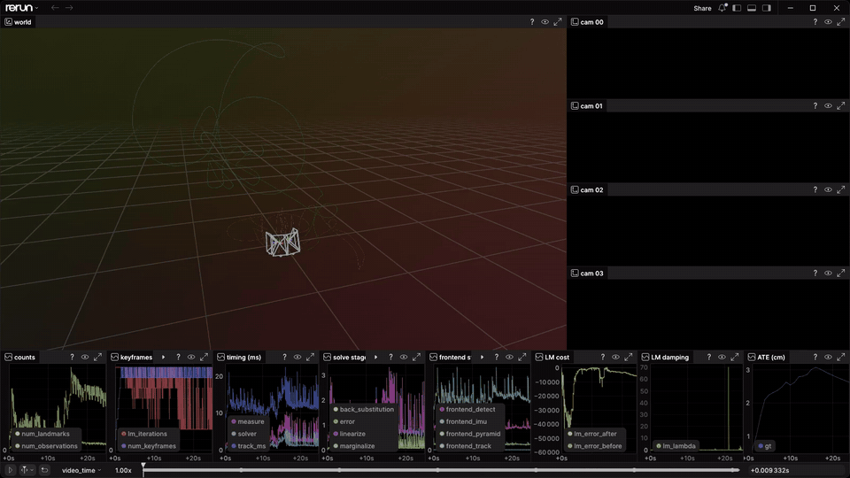

# slam-rs

<p align="center">
  
</p>

Visual-inertial odometry with a Rust core. The estimator is a port of the
basalt VIO fork: pure Rust, CPU first, N-camera from the start. Python owns the
plumbing — catalog feed, decode, evaluation and Rerun logging — and talks to the
core through a PyO3 extension module, so the whole pipeline runs from Python:
`_core.Vio` consumes IMU samples and framesets and reports a pose, and
`tools/apps/replay.py --stage vio` draws the estimate against the ground truth
and against the basalt C++ reference on the same frames. On the smoke segment it
is 0.31 cm from the C++ trajectory and 1.50 cm from ground truth, where the C++
itself is 1.43 cm. The same code runs unchanged on `linux-64`, `linux-aarch64`
and macOS `osx-arm64`.

Design notes — the module-by-module account of the port, the full Python API,
the reference set and the gates: [docs/design-notes.md](docs/design-notes.md).

## Run it

The pixi tasks run from anywhere in the repository; the `python tools/...`
commands below run from `packages/slam-rs`. Install the environment and build
the core:

```bash
pixi install -e slam-rs-dev
pixi run -e slam-rs-dev --frozen slam-rs-build   # cargo build + install _core.so in place
```

Then replay a segment. `--stage vio` is the whole pipeline; `--stage input` (the
default) logs only what the estimator is fed, and `--stage frontend` runs the
optical flow over it and draws its keypoints beside the C++ fork's:

```bash
cd packages/slam-rs
pixi run -e slam-rs-dev --frozen python tools/apps/replay.py --stage vio   # the smoke segment, in a viewer
pixi run -e slam-rs-dev --frozen python tools/apps/replay.py --stage vio --rr-config.headless --rr-config.save data/replay-vio.rrd
pixi run -e slam-rs-dev --frozen python tools/apps/replay.py --stage vio --segment <segment-id>       # another reference segment
pixi run -e slam-rs-dev --frozen python tools/apps/replay.py --stage vio --rrd base.rrd --gt-rrd gt.rrd   # a recording of your own
```

In a shell without `DISPLAY`, pass `--rr-config.headless` or the spawned viewer
wedges the recording stream. A long segment still wants `--max-framesets`.

The GPU frontend is the off-by-default `gpu-wgpu` cargo feature, through
CubeCL and wgpu (Vulkan / Metal / DX12). It writes the in-place
`slam_rs/_core.so`; `--gpu` selects that frontend.

```bash
pixi run -e slam-rs-dev     --frozen slam-rs-wgpu-build   # a core whose `--gpu` is wgpu
pixi run -e slam-rs-dev     --frozen python tools/apps/replay.py --stage vio --gpu
```

Design notes: [the GPU lane](docs/design-notes.md#the-gpu-lane), and
[the portable lane, and the two silent failures](docs/design-notes.md#the-portable-lane-and-the-two-silent-failures).

On macOS everything above runs from the mac lane's environment, which is where
that platform's `slam-rs` features are solved: `-e slam-rs-osx-dev` in place of
`-e slam-rs-dev`.

## How data gets in and out

The library reads one thing: a recording in the dataforge rig schema. One base
`.rrd` per sequence carries the rig calibration, one video stream per camera and
the IMU stream. Ground truth and results are separate layer files that stack onto
the same entity paths.

Raw data, whatever its files look like (an EuRoC folder, a ROS bag, a vendor
SDK), is converted into that recording once, with a dataforge ingester. After
that every tool reads the same bytes: the viewer, this estimator, the C++
reference.

- One sequence: `tools/apps/replay.py --stage vio --rrd base.rrd [--gt-rrd gt.rrd]`.
  The feed serves the files from an in-process server; no catalog server is
  needed.
- Many sequences: register the base and layer files on a catalog server and
  address them by segment id through the reference manifest.

The estimate comes back the same way: a trajectory CSV, and a Rerun recording
that layers the estimated poses, the landmarks and the window onto the input,
beside the ground truth and the C++ run.

In code the contract is three calls: `Calibration` is the rig, `Vio.push_imu`
takes one IMU sample, `Vio.track` takes one synchronized frameset of `uint8`
images. The feed is the only adapter between the recording and those calls.

## Python API

```python
from pathlib import Path

from slam_rs import _core

calibration = _core.Calibration.from_catalog(feed.cameras, feed.imu)  # the feed's dataclasses
config = _core.VioConfig.from_json(Path("configs/msdmi_config.json").read_text())  # the file the C++ ran

vio = _core.Vio(calibration, config, threads=1)
vio.push_imu_batch(t_ns, gyro, accel)     # int64[n], float64[n, 3], float64[n, 3], uncalibrated
result = vio.track(t_ns, [left, right])   # uint8[h, w] per camera
result.status, result.world_from_rig      # VioStatus, [tx ty tz qx qy qz qw]

snapshot = vio.snapshot()   # None until a frameset has measured: the window, the landmarks, the LM numbers
frame = vio.flow_frame()    # the keypoints of the last accepted frameset, or None
```

The frontend alone is driven the same way, for a run that needs no backend:

```python
flow = _core.OpticalFlow(calibration, config, threads=1)
frame = flow.process(t_ns, [left, right])
frame.ids(0), frame.positions(0), frame.transforms(0), frame.occupancy(0)
```

One `track` call is basalt's whole pipeline for one frameset in the calling
thread (Offline mode, D17), so every result is final and a repeat run over the
same input is bit-identical. `VioStatus` has two states: `NeedMoreImu` where
basalt would block on its IMU queue, `Tracking` otherwise; `replay.py` holds
such a frameset and pushes it again once its samples arrive.

Design notes — the accessors field by field, every refusal and its ceiling, and
`Calibration.from_catalog`'s rules: [Python API](docs/design-notes.md#python-api).

## What exists

### Layout

| Path | What it is |
|---|---|
| `crates/slam-rs` | The core (`slam_rs` lib). No Python, no Rerun, no GPU. |
| `crates/slam-rs-py` | PyO3 `cdylib` built in place as `slam_rs/_core.so`. |
| `crates/slam-rs-cli` | `slam-rs` binary: a placeholder. `version` is the only subcommand that does anything; a replay runs through the Python tools. |
| `slam_rs/` | The Python package: stubs, Tyro entry points under `apis/`. |
| `tools/` | Thin CLI shims over `slam_rs/apis/`. |
| `reference_segments.toml` | The frozen reference set. |
| `configs/` | The basalt VIO configs the reference runs used, vendored from the fork. |
| `tests/reference/` | Checked-in basalt C++ trajectories the gate tests reproduce. |
| `slam_rs/reference_bundle.py` | Resolves the two long-tier artifacts kept out of git. |

`Cargo.lock` is committed. `cargo` never runs during `pixi lock` or
`pixi install`: the build is an explicit, cached pixi task.

### Core modules

| Module | What it is |
|---|---|
| `lie` | `So3`/`Se3` over any `f32`/`f64` scalar: Sophus's `exp`/`log`, the adjoint, basalt's four SO(3) Jacobians and the decoupled SE(3) pair. |
| `types` | `TimeCamId`, `KeypointId`/`LandmarkId`, `AbsOrderMap`, the three pose states and the two fixed-linearization wrappers. |
| `config` | basalt's `VioConfig`, read straight from `configs/*_config.json`. |
| `calib` | basalt's `Calibration`: extrinsics, the six shipped camera models, the 9- and 12-parameter IMU bias calibrations. |
| `camera` | `pinhole`, `kb4` and `pinhole-radtan8` with basalt's 4-D homogeneous `project`/`unproject` and their analytic Jacobians. |
| `image` | `ImageU16`: an owned flat 16-bit frame with an explicit row stride, and `interp`/`interp_grad`/`in_bounds` from `image.h`. |
| `pyramid` | The `PyramidBuilder` stage seam, `PyramidU16`, and `CpuPyramidBuilder`, whose `subsample` is bit-exact with `image_pyr.h`. |
| `landmark` | `StereographicParam`, the three-parameter `Landmark`, and `LandmarkDatabase` with a reproducible iteration order (D31). |
| `ba_base` | `BundleAdjustmentBase`: the window state maps, Huber-weighted `compute_error`, the reprojection residual and its three Jacobians, DLT `triangulate`. |
| `imu` | Preintegration: basalt's midpoint propagation, the covariance and bias-Jacobian recurrences, the 9-vector residual, gravity initialisation. |
| `frontend` | The optical-flow frontend: `patterns`, `se2`, `ldlt`, `patch`, `tracker`, `detect`, `flow` (`FrameToFrameOpticalFlow`) and `parallel`. |
| `linearize` | The square-root linearization: `LandmarkBlock` and `LinearizationAbsQR`, which produce `H`, `b`, `Q2Jp`, `Q2r` and `l_diff`. |
| `marg` | Square-root marginalization: `MargHelper`'s rank-revealing flat Householder QR and `marginalizeHelperSqrtToSqrt`. |
| `eigen` | The Eigen ports in one place — `qr`, `ldlt`, `svd`, `blas` — each reproducing Eigen's **operation order** rather than only its result (D44). |
| `estimator` | The Offline sliding-window driver: `process_frame`, `schedule` (the keyframe vote and the keep/marginalize sets) and the Levenberg-Marquardt `optimize`. |

Design notes — what each module reproduces, quoted against the C++ it comes from
([Core modules](docs/design-notes.md#core-modules)), and the four stages where an ulp or a rank
decision is load-bearing: [the frontend](docs/design-notes.md#the-frontend-and-the-one-thing-that-is-not-bit-parity),
[the landmark stage](docs/design-notes.md#the-landmark-stage-and-where-an-ulp-is-load-bearing),
[marginalization](docs/design-notes.md#marginalization-and-where-a-rank-decision-is-load-bearing),
[the damping machinery](docs/design-notes.md#the-damping-machinery-the-shipped-vio-never-uses).

## Accuracy and speed

| lane | on what | reads |
|---|---|---|
| CPU | the smoke segment | 0.31 cm from the C++ trajectory, 1.50 cm from ground truth, where the C++ itself is 1.43 cm |
| GPU, wgpu | the two smoke clips | the same as the CPU lane's: 0.31 cm against the basalt C++ trajectory, 0.77 and 1.50 cm against ground truth |
| GPU, wgpu | the seven machines of the fleet run (x86-64, Grace, Pi 5, RK3588, Jetson, Mac) | the same on every device that runs it |
| GPU | discrete NVIDIA | 1.4x on a 5090 through Vulkan |
| GPU | shared-memory SoCs | slower than the CPU lane, so a portability result there, not a speed one |

D71 closes the measured MIO14 accuracy miss: small-angle GPU trigonometry brings
`MIO14_moving_props` from 11.98 to **9.48 cm**, below the unchanged **10.63 cm**
limit. The separate finite-check fix alone leaves that trajectory byte-identical.
The four short benchmark clips retain their GT ATE within 0.0011 cm, and the CPU
MIO10 trajectory stays byte-identical. These are targeted replay results, not a
fresh ten-clip or all-device gate run. The default build remains CPU-only.

Design notes — what the precision band is and why (D60), and the fleet table:
[the portable lane](docs/design-notes.md#the-portable-lane-and-the-two-silent-failures),
[where it runs](docs/design-notes.md#where-the-portable-lane-runs).

## Tests and gates

```bash
pixi run -e slam-rs-dev --frozen slam-rs-build      # cargo build + install _core.so in place
pixi run -e slam-rs-dev --frozen tests              # pytest (depends on the build)
pixi run -e slam-rs-dev --frozen lint               # ruff
pixi run -e slam-rs-dev --frozen typecheck          # pyrefly
pixi run -e slam-rs-dev --frozen deadcode           # vulture
pixi run -e slam-rs-dev --frozen slam-rs-clippy     # cargo clippy -D warnings
pixi run -e slam-rs-dev --frozen slam-rs-rust-test  # cargo test --workspace
pixi run -e slam-rs-dev --frozen slam-rs-version    # print the core version
```

The wgpu lane's gates run from the base feature on every Linux platform the package
declares, and from `slam-rs-osx-dev` on the Mac, where Metal is the backend:

```bash
pixi run -e slam-rs-dev     --frozen slam-rs-wgpu-clippy  # the portable lane compiles and is warning-clean, tests included
pixi run -e slam-rs-dev     --frozen slam-rs-wgpu-test    # the same kernels, on this host's GPU
pixi run -e slam-rs-osx-dev --frozen slam-rs-wgpu-test    # the same kernels through Metal
```

The oracle lanes are the fixtures the C++ fork itself produced — pyramid, camera,
IMU, landmark, linearization and marginalization, under
`crates/slam-rs/tests/fixtures/`, plus the frontend's keypoint parity in
`crates/slam-rs/tests/flow_parity.rs` — and they run inside `slam-rs-rust-test`.

The smoke digest is checked in: `frames.sha256` and a copy of `gt.csv` under
`tests/reference/msd/<segment>/` for the smoke pair, so that gate runs with no
NAS and no catalog. The rest of the slow lane reads a reference `.rrd` from the
NAS or queries the catalog, and skips when neither is reachable:

```bash
cd packages/slam-rs
pytest -m slow -q                                             # NAS + catalog
pytest -m slow -q -s tests/test_v2_gate.py                    # the iteration set
SLAM_RS_V2_ALL=1 pytest -m slow -q -s tests/test_v2_gate.py   # all ten, whole, shortest first
SLAM_RS_V2_WINDOW_S=5 SLAM_RS_V2_ALL=1 pytest -m slow -q -s tests/test_v2_gate.py   # all ten, first 5 s each
```

Design notes — the [reference set](docs/design-notes.md#the-reference-set) and its three tiers, the
[gate policy](docs/design-notes.md#the-basalt-c-reference-and-the-gate-policy) per segment,
[two clocks](docs/design-notes.md#two-clocks-converted-once), the
[feed, the metrics and the replay tool](docs/design-notes.md#the-feed-the-metrics-and-the-replay-tool)
with its entity trees, every clause of [the V2 gate](docs/design-notes.md#the-v2-gate), and what
[the fast and slow lanes](docs/design-notes.md#tests) each cover.

## What is next

Not in this stack, in the order they are likely to matter:

- **GPU speed.** D71 brings MIO14 moving props within its accuracy limit.
  The GPU frontend is faster only on
  discrete NVIDIA (1.4x on a 5090 through Vulkan); on shared-memory SoCs it is
  slower than the CPU lane. The kernels were written for correctness first.
  Brush's portable CubeCL kernels are a reference for the next pass.
- **More datasets.** `msd-odyssey` should run as is. Camera-only datasets (Assembly101,
  HO-Cap, the WildCap sets) need basalt's vision-only estimator ported beside the
  VIO. Aria recordings need the fisheye624 camera model.
- **Results as a catalog layer.** One layer per segment with the estimated poses, the
  landmarks and the keypoints on the base recording's entity paths, registered beside
  the ground truth, so a run is browsed in the viewer, not in a CSV.
- **A catalog URL on the command line.** The feed reads the catalog already; the replay
  tool only reaches it through manifest entries.
- **Less code.** Under the tolerance requirement (D60, D64) the Lie groups and the camera
  models could come from kornia-rs and the Eigen-order QR, LDLT and SVD from nalgebra;
  the ten-clip gate decides. About 2,800 lines.
