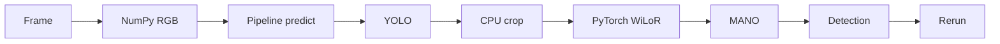

# WiLoR Nano

Hand detection and 3D hand pose estimation with [WiLoR](https://github.com/rolpotamias/WiLoR), packaged for the examples monorepo with Rerun logging.

- **Original project:** [rolpotamias/WiLoR](https://github.com/rolpotamias/WiLoR)
- **Package:** `wilor-nano`
- **Import path:** `wilor_nano`
- **Pixi envs:** `wilor`, `wilor-dev`

## Run

Run commands from the workspace root:

```bash
pixi run -e wilor --frozen image-example
pixi run -e wilor --frozen video-example
pixi run -e wilor --frozen video-trt --video-path assets/video.mp4
```

Available WiLoR tasks:

```bash
pixi task list -e wilor
```

Current task surface:

- `image-example`: original PyTorch image path.
- `video-example`: original PyTorch video path, one frame at a time.
- `video-trt`: optimized batched TensorRT video path.
- `export-onnx`: export portable ONNX graphs.
- `build-trt`: build machine-local TensorRT engines from ONNX.
- `compare-reference`: compare `/tmp/wilor_candidate.rrd` against the checked-in 30-frame reference RRD.

## Pipelines

### Original PyTorch Path

The original path keeps the public WiLoR inference flow simple and processes video frame by frame.



Use it when you want the baseline behavior or a simple reference path:

```bash
pixi run -e wilor --frozen video-example --video-path /path/to/video.mp4
```

### Batched TensorRT Path

The optimized path is intentionally separate from the original path. It keeps frames and crops on CUDA until the final records are prepared for Rerun.


Use it for fast video processing:

```bash
pixi run -e wilor --frozen video-trt --video-path /path/to/video.mp4
```

The default TensorRT engines are expected under:

```text
packages/wilor-nano/pretrained_models/tensorrt/wilor_full_postcrop_static_b224_fp16.trt
packages/wilor-nano/pretrained_models/tensorrt/detector_raw_static_b110_512x416_tf32.trt
```

TensorRT engines are machine-local artifacts. Keep ONNX as the portable artifact and rebuild `.trt` engines on the target GPU.

## TensorRT Conversion

Export the full WiLoR and detector ONNX graphs:

```bash
pixi run -e wilor --frozen export-onnx --artifact.target full_postcrop
pixi run -e wilor --frozen export-onnx --artifact.target detector_raw
```

Build the machine-local TensorRT engines:

```bash
pixi run -e wilor --frozen build-trt --artifact.target full_postcrop
pixi run -e wilor --frozen build-trt --artifact.target detector_raw
```

For a small conversion smoke test that does not overwrite the production engine paths:

```bash
pixi run -e wilor --frozen export-onnx --artifact.target full_postcrop --artifact.batch-size 1 --artifact.onnx-path pretrained_models/tensorrt/smoke/wilor_full_postcrop_static_b1.onnx
pixi run -e wilor --frozen build-trt --artifact.target full_postcrop --artifact.batch-size 1 --artifact.onnx-path pretrained_models/tensorrt/smoke/wilor_full_postcrop_static_b1.onnx --engine-path pretrained_models/tensorrt/smoke/wilor_full_postcrop_static_b1_fp16.trt

pixi run -e wilor --frozen export-onnx --artifact.target detector_raw --artifact.batch-size 1 --artifact.onnx-path pretrained_models/tensorrt/smoke/detector_raw_static_b1_512x416.onnx
pixi run -e wilor --frozen build-trt --artifact.target detector_raw --artifact.batch-size 1 --artifact.onnx-path pretrained_models/tensorrt/smoke/detector_raw_static_b1_512x416.onnx --engine-path pretrained_models/tensorrt/smoke/detector_raw_static_b1_512x416_tf32.trt
```

## RRD Comparison

Generate a 30-frame TensorRT candidate and compare it against the reference recording:

```bash
pixi run -e wilor --frozen video-trt --max-frames 30 --rr-config.save /tmp/wilor_candidate.rrd --rr-config.headless
pixi run -e wilor --frozen compare-reference
```

The current TensorRT comparison tolerance is `rtol=0.01, atol=0.25` because CUDA video decode is not bit-exact with the OpenCV-generated reference.

## Development

Use the dev environment for tests, linting, type checking, and runtime beartype validation:

```bash
pixi run -e wilor-dev --frozen pytest -q packages/wilor-nano/tests
pixi run -e wilor-dev --frozen ruff check packages/wilor-nano
pixi run -e wilor-dev --frozen pyrefly check packages/wilor-nano
```

The package downloads required model weights on first use.

## Acknowledgements

This package is based on [WiLoR](https://github.com/rolpotamias/WiLoR). Thanks to the original authors for releasing the model and code.
